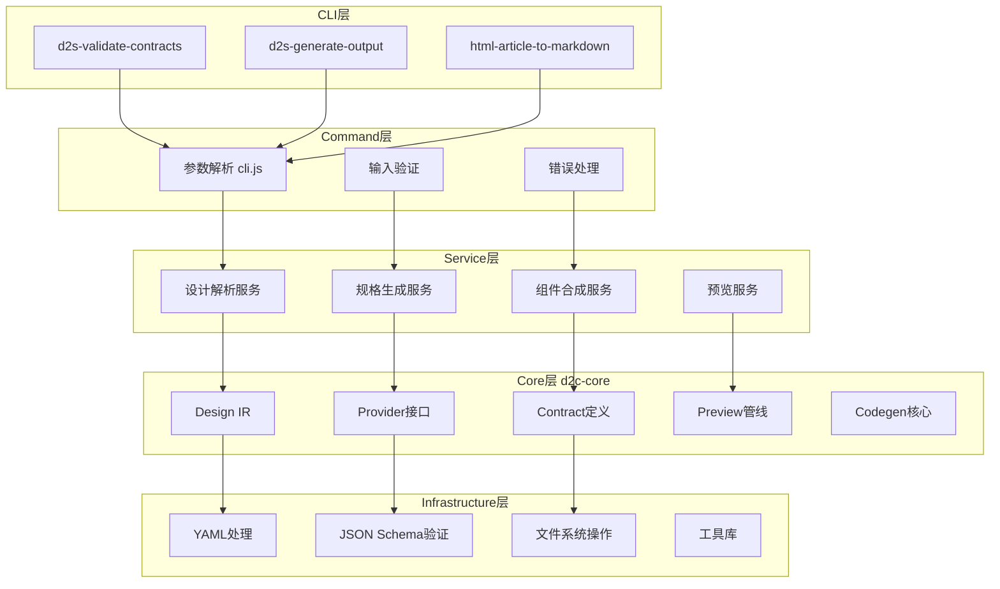

# 系统架构

## 概览

skill-collections是一个设计源到组件转换的AI工具集monorepo，实现从各种设计输入（UI稿、截图、Sketch文件、HTML）到可用组件的自动化转换。

## 系统分层架构

## 关键路径分析

### 设计到规格转换路径

`packages/d2c-core/src/index.ts:6` → IR模块 → Provider接口 → Contract生成

### 命令行处理路径

`skills/design-to-spec/scripts/lib/cli.js:1` → parseArgs → Service调用

### 预览生成路径

Preview模块 → HTML渲染 → 保真度验证

## 设计原则

1. **确定性管线**：每个阶段输出可预测，避免随机性
2. **分离关注点**：设计解析、业务逻辑、输出生成独立
3. **可测试性**：每层都有对应测试覆盖
4. **增量改进**：支持阶段性门禁和IR保真审计

## 技术债识别

基于madge依赖分析和代码审查，当前主要技术债：

1. **循环依赖**：未发现明显循环依赖
2. **重复逻辑**：多个skill中存在类似的CLI参数处理模式
3. **抽象层次**：Provider接口实现较为分散
4. **扩展瓶颈**：新skill接入需要较多样板代码
