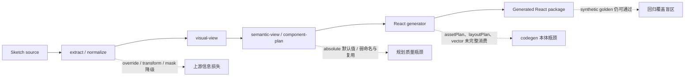

# React Codegen 当前瓶颈审计

日期：2026-06-06

## 结论

当前管线能够稳定生成可编译、可渲染的 React 包，但距离“设计稿到可用 React
实现”仍有明显差距。现阶段的主要瓶颈不是代码是否生成，而是高保真信息没有完整
进入最终 React 产物。

按影响排序：

1. **P0：图片资产在 preview 可用，但 React codegen 明确不输出资产。**
2. **P0：现有 visual regression 只覆盖 6 个节点的 synthetic golden，无法阻止真实
   Sketch 输入的资产、复杂布局和 symbol override 回归。**
3. **P1：React generator 不消费 `component-plan.layoutPlan`，所有 247 个渲染节点
   最终仍使用固定像素绝对定位。**
4. **P1：vector、compound path、gradient text 等 preview 已支持的视觉能力没有在
   React generator 中实现对等输出。**
5. **P1：组件规划在真实输入上产生大量数字后缀和非语义名称，生成结果可读性及复用
   价值偏低。**
6. **P1：symbol override、transform、mask、corner radius 等信息在 codegen 之前
   已经降级，React generator 无法从现有契约恢复。**

因此，下一阶段不应继续只修零散 CSS。建议先建立真实输入回归基线，然后优先打通
`assetPlan -> emitted files -> React references`，再处理 `layoutPlan` 和 vector/style
能力。

## 本次审计范围

真实输入：

```text
skills/sketch-to-component/resource/d2c.sketch
```

实际执行了完整链路：

```text
extract -> normalize -> preview -> contract -> approve -> codegen
```

临时产物目录：

```text
/private/tmp/skill-collections-codegen-audit.lgV3l2
```

本次没有修改 generator、contract、fixture 或 CI 行为。

## 管线结果

| 阶段            | 结果                                        |
| --------------- | ------------------------------------------- |
| extract         | 2 pages、5 assets、3 extracted images       |
| normalize       | 248 nodes、81 warnings                      |
| preview         | 3 real image assets、0 placeholders         |
| contract        | 43 components、47 layouts、4 planned assets |
| codegen         | 133 files、43 TSX、43 CSS Modules           |
| codegen warning | `4 planned asset(s) are not emitted yet`    |

生成代码规模：

| 指标                           | 数量 |
| ------------------------------ | ---: |
| TSX 行数                       |  944 |
| CSS 行数                       | 3538 |
| `.module.css` 中的绝对定位规则 |  247 |
| `display: flex`                |    0 |
| `display: grid`                |    0 |
| `role="img"` 占位节点          |    4 |
| `background-image`             |    0 |

聚焦验证全部通过：

- `npm run test:d2c`：54 files / 398 tests passed
- `npm run test:sketch`：16 files / 134 tests passed
- `npm run check:fixtures`：lint、6 tests、build 全部通过
- golden visual harness：`No metric failures`

这说明当前问题属于**已知能力缺口和回归覆盖缺口**，而不是现有测试已经能捕获的失败。

## 可见结果

同一次真实输入管线中：

- preview 页面能够显示 3 张真实酒店图片；
- React 页面在对应区域只显示灰色虚线占位块；
- React 页面主体已经能够按 375 x 1173 固定画布显示；
- 页面在不同容器宽度下不会形成真正的响应式布局；
- 组件名称和文件结构出现 `Icon2`、`Recommendation6`、`Nodea973bae5`
  等机械名称。

fresh codegen 与现有 `d2c-real-react/fixed` 的 CSS 完全一致。TSX 的主要差异是新增
`data-d2c-node-id`，因此现有 fixed viewer 可作为本次输出的视觉等价展示。

## 问题 1：资产链路在 React codegen 处中断

**优先级：P0**

### 现象

`component-plan.json` 已经包含 4 条 `assetPlan`，其中对应 3 个去重后的真实 bitmap。
preview 目录实际输出约 2.28 MB 的 3 张 PNG，但 generated React 包没有 `assets/`
目录，也没有图片 import 或 URL。

4 个 media 节点被生成成：

```tsx
<div role="img" aria-label="..." />
```

对应 CSS 是灰色背景和虚线边框。

### 直接原因

React generator 对 media 节点只生成占位 `div`：

- `packages/d2c-core/src/codegen/react/generate.ts:294`
- `packages/d2c-core/src/codegen/react/generate.ts:452`

generator 在发现 `assetPlan` 非空时只输出 warning：

- `packages/d2c-core/src/codegen/react/generate.ts:578`

### 根因

当前 `TargetGenerator` 的输入和文件计划能够看到 `assetPlan`，但没有把原始 asset
bytes 或可复制文件的来源交给 React emitter。preview 使用独立的 real-assets map，
这条能力没有延伸到 codegen。此外输出侧同样受限：`CodegenFile.content` 是 `string`，
落盘走 `writeFile(..., 'utf8')`，现有 seam 无法承载二进制——因此修复需同时处理
输入与输出两端（见下「解决方案」）。

### 影响

这是当前视觉差距最大的单点问题。只要真实图片仍被替换为占位块，React 结果就不可能
与设计稿或 preview 达到高保真一致。

### 解决方案（2026-06-06 决策）：reference + CLI copy

采用「引用 + CLI 复制」：generator 保持纯函数与纯文本输出，IO 与文件路径不进入
`d2c-core`。契约保持 `CodegenFile.content: string` 不变，新增结构化资产计划：

```ts
interface CodegenAssetFile {
  assetRef: string; // = AssetEntry.id（等于 image 节点的 assetRef）
  sourceFileName: string; // basename(originalPath ?? ref)，extract 已镜像该文件名
  outputPath: string; // 包内目标，如 src/assets/asset-xxx.png
}
// CodegenFilePlan 增加：assets: CodegenAssetFile[]
```

数据流：

```text
designIr.visual.assets
  -> planCodegenFiles 解析 assetRef/文件名（复用 loadRealImageAssets 的映射规则）
  -> React generator 生成 CSS url("../assets/asset-xxx.png")
  -> CodegenFilePlan.assets 描述复制计划（纯数据，无 IO）
  -> CLI 从 --assets 目录复制到 src/assets/
```

为什么这样选：

- generator 继续保持纯函数和纯文本输出，二进制不穿过 `CodegenFile.content`；
- 不把文件路径或 IO 引入 `d2c-core`；
- 不需要 `*.png` 的 TypeScript module declaration（用 CSS `url()` 而非 `import`）；
- `src/assets/` 随当前 `src/` rewrite 语义一并清理，不留旧资产；
- 重复 `assetRef` 在资产计划层按 `AssetEntry.id` 稳定去重。

已否决的替代方案：

- `CodegenFile.content: string | Uint8Array`：会扩大所有 writer、测试与 target 契约面；
- data URI：包体膨胀，缓存与 review 体验都差；
- CLI 事后改写生成的 CSS：边界隐蔽，确定性与可测性差。

可直接复用的现有能力：

- 解析器：`loadRealImageAssets`（`cli.ts:307`）已把 `designIr.visual.assets` 映射到
  `<assetsDir>/<basename(originalPath ?? ref)>`，并以 `AssetEntry.id`（即节点
  `assetRef`）为键——codegen 资产计划照搬这套映射即可。
- CLI 入参：`--assets <dir>`（指向 extract 的 `ir/assets`）已存在且 preview 在用，
  codegen 命令复用同一约定。

落点修正：真正的 codegen writer 是 `writeCodegenPackage`
（`skills/sketch-to-component/scripts/src/cli.ts:561`；`writeFile(..., 'utf8')` 在
`:566`，且 `:562` 先 `rm(src)`）。之前 review 误引的 `:443` 是 contract artifact
writer。资产复制应在 `writeCodegenPackage` 写完文本文件后，从 `--assets` 目录把二进制
拷到 `outDir/src/assets/`。

## 问题 2：现有 visual gate 不代表真实输入

**优先级：P0**

### 现象

现有 codegen golden fixture 只有：

- 6 semantic nodes
- 1 component
- 0 assets
- 2 absolute layouts

真实 `d2c.sketch` 则有：

- 248 semantic nodes
- 43 components
- 4 planned assets
- 47 layouts

golden visual harness 比较的是同一个 synthetic fixture 的 preview 与 generated golden，
并检查少量节点的 rect 和 computed style。它没有使用真实 Sketch screenshot 作为
baseline，也没有覆盖 asset emission。

### 根因

现有 gate 的目标是验证 preview 与 generated golden 的基础布局契约稳定，而不是验证
复杂真实输入的设计还原度。fixture 尺寸太小且没有图片、symbol override、复杂组件树，
导致 gate 绿灯与真实页面质量之间存在明显盲区。

### 影响

资产完全缺失、组件碎片化和真实输入复杂度问题都可以在 CI 绿灯的情况下继续存在。

## 问题 3：`layoutPlan` 没有进入 React CSS

**优先级：P1**

### 现象

真实 component plan 包含：

```text
absolute: 45
stack: 1
inline: 1
```

但最终 CSS 统计为：

```text
position: absolute: 247
display: flex: 0
display: grid: 0
```

根组件也被固定为 `width: 375px; height: 1173px`。

### 直接原因

`componentCss()` 直接从 visual node 的 `layout` 写入 `left`、`top`、`width`、
`height`，没有读取 `componentPlan.body.layoutPlan`：

- `packages/d2c-core/src/codegen/react/generate.ts:400`
- `packages/d2c-core/src/codegen/react/generate.ts:425`

### 上游原因

semantic derivation 默认给 screen、region、component 生成 `absolute` candidate，只有
明确识别出完整重复模式时才升级为 stack/inline：

- `packages/d2c-core/src/semantic/derive.ts:116`
- `packages/d2c-core/src/semantic/derive.ts:125`

这意味着布局瓶颈分为两层：

1. 上游大多数布局仍只能推断为 `absolute`；
2. 即使已经推断出的 `stack`/`inline`，React generator 也没有消费。

### 影响

生成页面只能作为固定画布复刻，难以适应内容变化、容器变化和业务组件复用。继续逐个
调整 `left/top` 只能改善单张截图，不能解决 React 实现质量。

## 问题 4：preview 与 React 的视觉能力不对称

**优先级：P1**

preview renderer 已经支持：

- real bitmap assets
- linear gradient
- gradient text
- vector path SVG
- compound SVG path

React generator 当前只处理第一条 fill、第一条 border、一个 shadow、一个 layer blur、
radius 和 opacity。对于 vector/compound path，没有生成对应 SVG；对于 image，只生成
占位节点。

相关位置：

- preview：`packages/d2c-core/src/preview/generate-preview.ts:208`
- preview image：`packages/d2c-core/src/preview/generate-preview.ts:275`
- preview vector：`packages/d2c-core/src/preview/generate-preview.ts:311`
- React style：`packages/d2c-core/src/codegen/react/generate.ts:175`
- React media：`packages/d2c-core/src/codegen/react/generate.ts:294`

### 根因

preview 和 React codegen 各自实现了一套 renderer，能力没有共享，也没有明确的
feature-parity contract。preview 的能力演进不会自动进入 React 输出。

### 影响

即使 visual-view 已经保留了正确信息，最终 React 仍可能丢失渐变、矢量几何和复杂样式。

## 问题 5：组件边界和命名质量不足

**优先级：P1**

真实输入生成 43 个组件，其中重复命名族包括：

| 名称族          | 数量 |
| --------------- | ---: |
| Icon            |   10 |
| Recommendation  |    6 |
| Ai              |    4 |
| KeyboardInput   |    3 |
| SuggestedPrompt |    3 |
| ArrowIcon       |    3 |
| NavigationBar   |    3 |
| StatusBar       |    2 |

另有 3 个泛化名称：

```text
Nodea973bae5
Nodee5e368de
Nodeb8b3c615
```

### 根因

组件名称主要来自 symbol instance、layer-name prefix 和 repeated structure。遇到
同名 candidate 时，上游使用数字后缀确保导出唯一；低置信度的 repeated structure
则可能退化为 hash 名称。React generator 只是忠实输出 component plan。

### 影响

输出文件数量多但复用语义弱，开发者仍需人工识别哪些组件属于同一类型、哪些应变成
props 驱动的单个组件。这是“能生成”到“可维护 React”之间的主要障碍之一。

## 问题 6：codegen 之前已经发生视觉降级

**优先级：P1**

本次 normalize/preview 报告包含：

| Warning                           | 数量 | 后果                                      |
| --------------------------------- | ---: | ----------------------------------------- |
| low-confidence-semantic-candidate |   29 | 组件边界和命名不稳定                      |
| hidden-node-skipped               |   25 | 隐藏层被主动排除                          |
| radius-point-order-ambiguous      |   15 | 圆角按 fallback 顺序解释                  |
| unsupported-symbol-override       |   10 | symbol variant、fill、border 颜色可能错误 |
| clipping-mask-skipped             |    8 | 仅用 `overflow:hidden` 近似               |
| unsupported-symbol-transform      |    4 | resize 内 rotation/flip 未完整还原        |

这些问题发生在 provider/normalize/semantic 阶段。React generator 只能消费已经降级的
visual-view 和 component-plan，不能在末端猜回丢失的信息。

因此后续评估必须区分：

- **codegen-local**：资产不输出、layoutPlan 不消费、vector/style parity 不足；
- **upstream contract**：override、transform、mask、radius、component inference；
- **validation**：golden fixture 不代表真实输入。

## 次要边界

### 行为仍是 stub

React generator 明确只支持 `presentational` mode，event handlers 和 data bindings
仍是 placeholder。这是当前 Stage 6 v1 的既定边界，不是本轮视觉瓶颈的第一优先级。

### 负坐标不能直接视为缺陷

生成 CSS 仍包含部分负 `left/top`。mask、裁剪和溢出装饰本身可能需要负坐标，因此
不能按数量直接判错。后续应通过真实节点级 visual comparison 判断哪些是合法溢出，
哪些是坐标或 transform 错误。

### 本地受限环境需要额外权限

受限 sandbox 中，`tsx` IPC 和本地端口监听出现 `EPERM`；使用允许本地进程和端口的
执行方式后完整管线与 viewer 均正常。这是执行环境问题，不是 codegen 根因。

## 根因分层



## 建议的处理顺序

### 0. 先建立真实输入回归基线（双层策略）

**固化的是可复现流程与代表性 fixture，不是当前待优化的指标。** 43 components、247
absolute rules 这类数字正是后续要降低的目标，绝不能写成永久 golden。

**CI 层**：提交一个裁剪后的 realistic fixture，保留图片复用、嵌套组件、vector、
gradient、symbol override 与 stack/inline。在 visual harness 中至少检查：

- preview 与 generated React 的节点存在性；
- 相对位置、尺寸和关键 computed styles；
- 真实资产是否出现；
- 截图差异；
- 生成文件与 source hash 的确定性。

**本地审计层**：提供一条可重复运行完整 `d2c.sketch` 的命令，输出机器可读的 metrics
JSON，供人工对比趋势（不进 CI 断言）。

断言「能力结果」而非「规模快照」，例如：

```text
requiredAssetsMissing = 0
mediaPlaceholders     = 0
emittedUniqueAssets   = 3
stackInlineConsumed   > 0
build                 = passed
visualFailures        = 0
```

### 1. 打通资产输出（PR-2）

按上文「reference + CLI copy」决策实现：generator 产出 CSS `url(...)` 引用 +
`CodegenFilePlan.assets` 复制计划，CLI 从 `--assets` 复制二进制到 `src/assets/`，
media node 不再生成占位 `div`。

硬验收标准（缺一不可）：

1. 4 个 planned asset 全部解析，3 个唯一 bitmap 文件落盘；
2. `required` asset 缺失时直接失败，不再静默生成占位；
3. React 页面显示真实图片，且不再输出 asset warning；
4. 带资产的生成包通过 `tsc`、`check:fixtures` build 与浏览器运行；
5. 同输入重复运行，文本与二进制文件集合及 hash 完全一致；
6. visual gate 在删除任意 `required` asset 时主动失败。

### 2. 消费 `layoutPlan`

先让已存在的 `stack`/`inline` 计划真正生成 flex/grid，再扩大上游 layout inference。
不要直接从 247 条绝对定位规则做大范围启发式重写。

### 3. 建立 preview/codegen feature parity

为 bitmap、gradient、gradient text、vector、compound path、mask approximation 建立
显式能力矩阵和共享测试。优先复用纯 rendering helpers，减少两套 renderer 漂移。

### 4. 提升组件规划质量

在真实 fixture 上定义可量化目标：

- 减少泛化 `Node<hash>` 名称；
- 将同构 `RecommendationN` 合并为 props 驱动组件；
- 区分真正可复用 icon 与一次性 decorative shape；
- 降低 low-confidence component 数量。

### 5. 再处理上游 Sketch 语义缺口

按真实视觉影响排序处理 symbol override、transform、mask 和 radius ambiguity。每一类
修复都应在真实输入 visual gate 中有独立可见证据。

## 下一阶段完成标准

下一阶段不应以“测试通过”或“文件数量稳定”作为唯一完成标准。至少需要满足：

1. 真实输入 preview 与 React 均显示实际图片；
2. representative fixture 的 visual gate 能对资产缺失主动失败；
3. React generator 至少消费已有的非 absolute layout plan；
4. 生成结果在重复执行后文件集合与内容 hash 稳定；
5. 文档明确列出仍未支持的视觉能力，warning 不再成为唯一反馈渠道。
