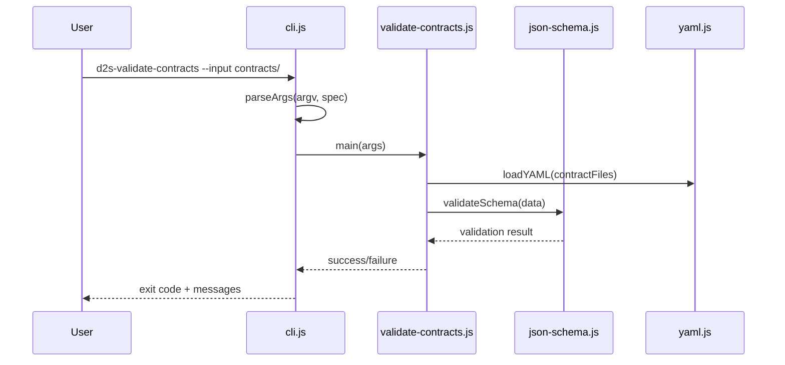
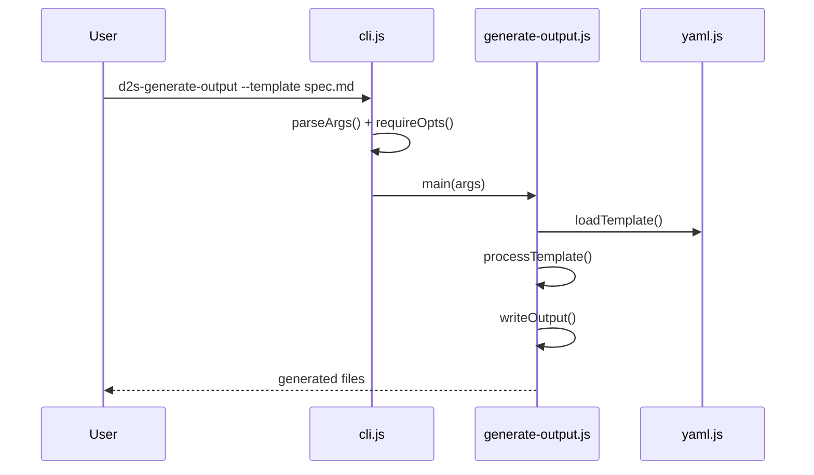
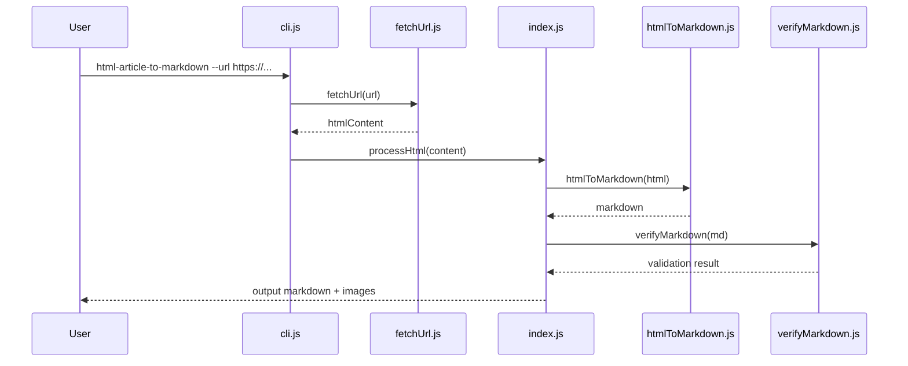
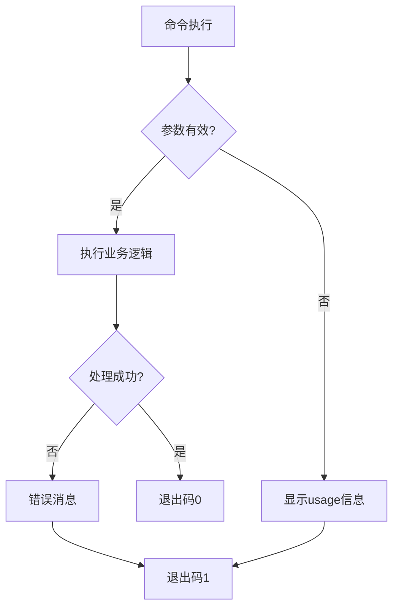

# 命令执行流程

## 主要命令入口

系统提供多个CLI命令，每个对应特定的处理流程：

### design-to-spec命令组

#### d2s-validate-contracts
验证设计规格契约的有效性

**关键路径**：
1. `skills/design-to-spec/scripts/lib/cli.js:1` - 参数解析
2. `skills/design-to-spec/scripts/validate-contracts.js` - 主验证逻辑
3. JSON Schema验证和YAML文件加载

#### d2s-generate-output  
生成设计规格输出文件

### html-article-to-markdown命令

## 通用处理模式

所有CLI命令遵循相似的执行模式：

1. **参数解析阶段**：`cli.js:parseArgs()` - 统一的命令行参数处理
2. **输入验证阶段**：`requireOpts()` - 必需参数检查
3. **业务逻辑阶段**：各skill特定的处理流程
4. **输出生成阶段**：文件写入或结果返回
5. **错误处理阶段**：统一的错误信息和退出码

## 错误处理流程

## 扩展点设计

新命令集成遵循的扩展模式：

1. **CLI接口标准化**：复用`cli.js`的参数解析器
2. **错误处理一致性**：统一的异常捕获和消息格式
3. **配置文件支持**：YAML配置文件的标准加载
4. **测试框架对接**：Node.js test runner集成