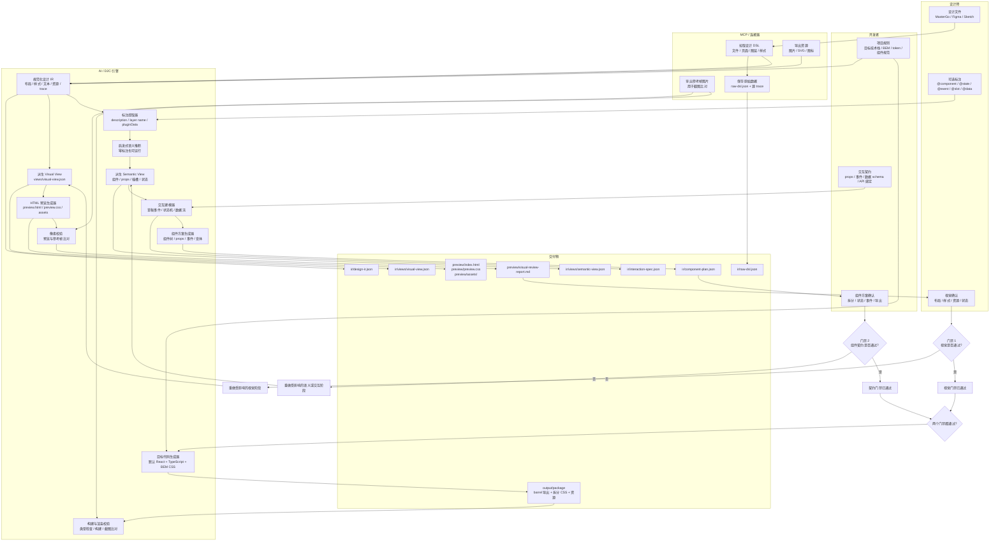

# 设计源到组件架构

## 决策

截图输入和设计源输入使用独立的工作流。

截图适合用于结构理解、状态对比和骨架生成，但它不包含可靠的样式数据。高保真的前端生成应当从能够暴露结构化布局、文本、样式、组件和资源数据的设计源系统开始。

设计源工作流使用一份唯一权威的规范化 IR，再从它派生出预览、语义、交互和代码生成等工件。第一版实现仍可能带有首个 provider 的形状，但 provider 中立性是目标契约，必须随着更多 provider 的接入逐步收敛。

目标输出技术栈由项目规则控制。第一版的默认技术栈是 React + TypeScript + BEM CSS。

长期的工作流家族如下：

```text
design-to-component
  image-to-component          # 截图/图片输入，结构优先的骨架工作流
  sketch-to-component         # Sketch 设计源 provider
  figma-to-component          # Figma 设计源 provider
  mastergo-to-component       # MasterGo 设计源 provider
```

## D2C 保真层

Design-to-code 存在两个不同的保真层。它们应当分别建模、分别评审。

| 层级       | 目标                       | 主要输入                           | 主要输出                                                                                    | 评审门禁      |
| ---------- | -------------------------- | ---------------------------------- | ------------------------------------------------------------------------------------------- | ------------- |
| 视觉保真层 | 让结果看起来与设计稿一致   | 设计 DSL、布局、样式、token、资源  | `ir/views/visual-view.json`、`preview/index.html`、`preview/preview.css`、`preview/assets/` | HTML 预览审批 |
| 契约保真层 | 让结果具备可维护的组件契约 | 标注、图层名、项目规则、开发者契约 | `ir/views/semantic-view.json`、`ir/interaction-spec.json`、`ir/component-plan.json`         | 组件方案审批  |

视觉保真层回答“看起来对不对”。契约保真层回答“生成的组件边界、API、状态和事件契约能不能用”。

契约保真层并不意味着生成器会实现业务处理函数。引擎可以生成草稿形态的 props、事件名、payload 结构和状态机，但开发者对交互语义拥有最终权威。

## 权威 IR 模型

提取完成后，只存在一份唯一权威数据源：

```text
ir/design-ir.json
```

`design-ir.json` 是规范化设计 IR。所有其他 JSON 输出都是它的派生视图或下游契约。

```text
ir/
  raw-dsl.json                  # provider 响应，保留用于可追溯性
  design-ir.json                # 唯一权威的规范化 IR
  views/
    visual-view.json            # 供预览渲染使用的派生视图
    semantic-view.json          # 供组件规划使用的派生视图
  interaction-spec.json         # 由开发者授权的交互契约
  component-plan.json           # 已批准的代码生成方案
```

放置规则：

- `views/` 存放从权威 IR 派生出的引擎投影产物。
- `ir/` 顶层文件存放源数据，或会对生成流程形成门禁的开发者授权契约。

术语必须保持一致：

| 术语                 | 含义                                                            |
| -------------------- | --------------------------------------------------------------- |
| Raw DSL              | MasterGo、Figma、Sketch 或其他连接器返回的、provider 专有的数据 |
| Normalized Design IR | 存放于 `ir/design-ir.json` 的、经 provider 规范化的权威契约     |
| Visual View          | 权威 IR 的派生视图，供预览渲染器使用                            |
| Semantic View        | 权威 IR 的派生视图，供组件规划使用                              |
| Interaction Spec     | 由开发者授权的事件、payload、状态与数据契约                     |
| Component Plan       | 在目标技术栈输出前已批准的最终代码生成方案                      |

`design-ir.json` 必须包含 schema 版本：

```json
{
  "schemaVersion": "d2c.design-ir/v0.2.0",
  "source": {
    "provider": "sketch",
    "ref": { "fileName": "example.sketch", "documentId": "doc-1" },
    "rootName": "Example Screen"
  },
  "visual": {
    "artboard": { "width": 375, "height": 812 },
    "assets": [],
    "root": {
      "id": "node-root",
      "kind": "frame",
      "name": "ExampleScreen",
      "source": {
        "nodeId": "root-1",
        "originalType": "artboard",
        "provider": "sketch"
      },
      "layout": { "x": 0, "y": 0, "width": 375, "height": 812 },
      "children": []
    }
  },
  "semantic": { "candidates": [] },
  "interaction": {
    "status": "draft"
  },
  "warnings": []
}
```

兼容规则：

- 补丁（patch）变更只能新增可选字段。
- 次要（minor）变更只能在提供迁移路径的前提下新增必填字段。
- 主要（major）变更允许破坏旧 provider，但必须附带迁移说明。
- 1.0 前的特例：major 为 `0` 期间，minor 升级一律视为破坏性 —— `isCompatible` 要求 major.minor 精确匹配（patch 忽略）。上面的 patch/minor/major 规则自 major ≥ 1 起生效。
- Provider 提取器必须写入它所面向的 `schemaVersion`。

## 端到端 D2C 架构

第一版不应依赖低代码平台 DSL。应当用设计源 DSL 解决视觉保真，用标注加开发者契约解决契约保真。

语义工作可以与视觉评审并行，但最终目标技术栈代码生成必须等到两个门禁都通过。



门禁拒绝时回到最小受影响阶段。视觉拒绝可能只需重做 token 对账、资源导出或 Visual View；除非权威 IR 本身有误，否则无需完整重做 DSL 规范化。契约拒绝可能只需重做 Semantic View、Interaction Spec 或 Component Plan。

## 职责与交付物

| 阶段         | 负责人            | 输入                              | 交付物                                                         |
| ------------ | ----------------- | --------------------------------- | -------------------------------------------------------------- |
| 设计准备     | 设计师            | 设计文件                          | 可访问的设计源与可导出的资源                                   |
| 语义标注     | 设计师 + 开发者   | 设计文件与业务意图                | 可选的 `@component`、`@state`、`@event`、`@slot`、`@data` 标注 |
| 项目规则设置 | 开发者            | 目标代码库规范                    | 技术栈规则、token 映射、BEM 规则、导出规则                     |
| DSL 提取     | MCP / 连接器      | 设计 URL、文件、页面或图层 id     | `ir/raw-dsl.json`、资源、参考帧图片、源 trace                  |
| IR 规范化    | D2C 引擎          | raw DSL、资源、项目 token         | `ir/design-ir.json`                                            |
| 视觉视图派生 | D2C 引擎          | 权威 IR                           | `ir/views/visual-view.json`                                    |
| HTML 预览    | D2C 引擎          | 由权威 IR 派生的 Visual View      | `preview/index.html`、`preview/preview.css`、`preview/assets/` |
| 视觉评审     | 设计师 + 开发者   | HTML 预览与截图比对               | `preview/visual-review-report.md` 与门禁 1 审批                |
| 语义映射     | D2C 引擎 + 开发者 | 权威 IR、标注、项目规则           | `ir/views/semantic-view.json`                                  |
| 交互建模     | 开发者 + D2C 引擎 | 交互契约与 Semantic View          | `ir/interaction-spec.json`                                     |
| 组件规划     | 开发者 + D2C 引擎 | Semantic View 与 Interaction Spec | `ir/component-plan.json` 与门禁 2 审批                         |
| 代码生成     | D2C 引擎          | 已批准的 Component Plan           | 带 barrel 导出的目标组件包                                     |
| 工程校验     | 开发者 + 工具     | 生成的代码                        | 类型检查、构建、渲染与截图比对报告                             |

## 为什么拆分这些工作流

`image-to-component` 从像素开始。截图可以展示某个 UI 曾经的样子，但它无法可靠地揭示：

- 精确的布局约束；
- 设计 token；
- 以具名样式形式存在的字体样式；
- 组件实例；
- 图层名；
- 可导出的位图资源；
- 矢量源数据；
- 真实的间距意图；
- 设计系统引用。

强行让截图输入产出高保真的生产代码，会把工作流推向猜测。它仍适合生成组件骨架，但不足以支撑设计源级别的实现管线。

设计源 provider 从结构化数据开始。Sketch、Figma 和 MasterGo 可以暴露更丰富的信号：图层、画板、约束、文本节点、填充、描边、token 或样式、组件实例，以及资源引用。这些 provider 应当汇入权威的规范化设计 IR，再复用同一套预览、契约规划和目标代码生成阶段。

## 工作流角色

| 工作流                  | 输入                        | 主要输出                        | 保真目标 |
| ----------------------- | --------------------------- | ------------------------------- | -------- |
| `image-to-component`    | UI 截图或设计稿图片         | 类型化骨架、状态模型、资源清单  | 低到中   |
| `sketch-to-component`   | Sketch 文件或 Sketch MCP/IR | 规范化设计 IR、预览、目标组件包 | 中到高   |
| `figma-to-component`    | Figma API/MCP 数据          | 规范化设计 IR、预览、目标组件包 | 中到高   |
| `mastergo-to-component` | MasterGo DSL                | 规范化设计 IR、预览、目标组件包 | 中到高   |

## 共享设计源管线

每个设计源 provider 都应遵循相同的阶段：

```text
设计源
-> Provider 提取器
-> 规范化设计 IR
-> HTML 预览评审门禁
-> Semantic View + Interaction Spec + Component Plan
-> 组件方案评审门禁
-> 目标组件包
```

### Provider 提取器

Provider 提取器是唯一了解 provider 专有细节的层。

示例：

- MasterGo 提取器读取 `MASTERGO_TOKEN`，解析 `fileId` 与 `layerId`，并请求 `/mcp/dsl`。
- Figma 提取器会读取 Figma 的文件/节点数据，并在支持的情况下导出图片。
- Sketch 提取器直接解析 `.sketch` 文件（公开的 JSON ZIP 包），后续也可经 SketchMCP。

Provider 原始数据不得被预览或目标代码生成直接消费。

### Provider 中立性

`ir/design-ir.json` 是共享的规范化目标，但第一版实现允许受首个 provider 的形状影响。应把 provider 中立性视为明确的迁移目标，而不是只接入一个 provider 后就已被证明的结论。

规则：

- 不要把 provider 专有的字段名复制进下游生成器，除非它们被隔离在 `source` 下。
- Provider 专有数据应保留在源元数据或 trace 记录中。
- 实现第二个 provider 时，再抽取两个 provider 都需要的中立概念。
- Provider 文档必须说明它当前依赖的 IR 版本与 provider 专有假设。

### 规范化设计 IR

规范化设计 IR 是提取与生成之间的公共契约。它应当保留：

- schema 版本；
- 源元数据；
- 页面与画板结构；
- 源节点 trace id；
- 文本内容；
- 预览所需的布局与样式数据；
- 资源引用；
- 语义组件候选；
- 交互脚手架状态；
- 警告与有损转换；
- 为文件、组件和 BEM 块生成的名称。

预览、语义映射和代码生成都消费这份权威 IR 的派生视图。

## 标注与语义降级

标注会提升契约保真度，但它不是硬性前置条件。

零标注运行也必须可执行：

1. 从图层名、组件实例、几何信息、重复编组和文本角色推断语义候选。
2. 为每个推断出的组件、prop、插槽、状态和事件标注置信度。
3. 将低置信度项写入 `warnings`。
4. 在生成目标技术栈代码前，要求开发者在门禁 2 中审批。

降级行为：

- 未知的视觉节点仍通过通用布局原语在预览中保持可渲染。
- 未知的语义区域成为带警告的 `GenericSection` 候选。
- 未知事件不得被编造为已批准的处理函数。它们只能作为草稿建议出现。
- 如果生成器无法推断出公开的组件 API，必须在目标代码生成前停止，并请求门禁 2 输入。

## Token 对账

Token 映射是视觉保真的核心变量，必须是确定性的。

映射优先级：

1. 显式的标注或项目规则映射。
2. 在项目规则中映射的 provider 样式或 token id。
3. 与项目 token 的精确值匹配。
4. 阈值内的最近邻匹配，标记为 `pending`。
5. 字面值兜底，并附带警告。

默认阈值策略：

- 颜色：先按规范化后的颜色值精确匹配；最近邻候选需要较小的感知色差，并且必须保持 `pending` 直到被确认。
- 间距与尺寸：先精确匹配 px/rem/token；最近邻候选必须保持 `pending`。
- 圆角与阴影：先匹配具名 token 族；否则使用字面值兜底并加警告。

生成器不得静默地把低置信度的原始值映射为项目 token。

## 截图比对参考图

截图比对将生成结果与 provider 导出的参考图片进行对比。

参考图规则：

- 对设计源输入，参考图片是 provider 导出的画板或图层渲染图。
- 如果 provider 无法导出参考图片，用户必须自行提供一张；否则截图比对步骤带警告跳过。
- 不要直接与原始设计 DSL 对比。比对要求两侧都是已渲染的像素。

默认阈值策略：

- 通过：差异在配置的容差范围内，且没有关键资源缺失。
- 警告：差异超出容差，但局部且可解释。
- 失败：差异范围大、阻塞视觉评审，或掩盖了布局、字体或资源数据的缺失。

精确阈值应允许按项目配置，因为字体渲染、浏览器引擎和导出管线之间的差异很大。

## 错误与中止语义

管线必须区分部分输出与致命失败。

致命失败会停止运行：

- 设计 DSL 无法获取；
- 目标文件、页面或图层 id 无法解析；
- raw DSL 无法解析；
- 权威 IR 未通过 schema 校验；
- 节点数量超过配置的安全上限；
- 门禁 1 或门禁 2 被拒绝，且未提供重试输入。

可恢复失败会产出带警告的部分输出：

- 单个资源导出失败；
- token 映射兜底为字面值；
- 未知的语义组件候选；
- 缺少可选标注；
- 因没有参考图片导致截图比对不可用。

可恢复失败可以生成预览输出。如果它们影响公开的组件契约，则不得静默生成最终目标代码。

## 重生成与人工修改

生成的输出默认应被视为可替换产物。

第一版规则：

- 生成的组件包文件归生成器所有。
- 人工修改应放在生成包之外的包装组件、适配文件或上游项目代码中。
- 除非用户传入显式的覆盖选项，否则生成器不得覆盖已有的组件包。
- 重生成应创建新的运行目录，或在替换生成输出前输出变更报告。

设计迭代流程：

```text
新的设计 DSL
-> 新的 raw-dsl.json
-> 新的 design-ir.json
-> 对比源节点 trace 与组件方案
-> 输出变更报告
-> 重新运行预览与门禁
```

受保护的人工修改区域不属于第一版契约。只有在生成器具备稳定的归属权和变更检测能力后，再引入它们。

## HTML 预览门禁

设计源工作流必须先生成静态 HTML，再输出目标组件。预览用于开发者与视觉评审。

规则：

- 先生成 `preview/index.html`、`preview/preview.css` 和预览资源。
- 包含 `preview/visual-review-report.md`。
- 在参考图片可用时，将预览截图与 provider 导出的参考图片对比。
- 在门禁 1 批准预览之前，停止目标代码生成。

语义提取可以在门禁 1 待审批期间运行，但目标代码生成必须等待门禁 1 审批。

这能避免未经批准的视觉猜测扩散到大量组件文件中。

## 交互规格门禁

仅有 HTML 预览审批不足以生成可维护的组件。在视觉门禁之后或与之并行，工作流必须先产出 interaction spec 和 component plan，再进行目标代码生成。

`interaction-spec.json` 捕获：

- 组件状态；
- 用户事件；
- 事件 payload；
- 处理函数 prop 名；
- 数据模型；
- 已知的状态转移；
- API 或数据绑定说明；
- 置信度与审批状态。

示例：

```json
{
  "component": "ChatAssistantPage",
  "status": "draft",
  "states": ["idle", "loading", "error"],
  "events": [
    {
      "name": "submitMessage",
      "source": "InputComposer",
      "payload": { "text": "string" },
      "handlerProp": "onSubmitMessage",
      "confidence": "developer-provided"
    }
  ],
  "data": {
    "messages": "Message[]",
    "currentUser": "User"
  },
  "stateMachine": [
    { "from": "idle", "on": "submitMessage", "to": "loading" },
    { "from": "loading", "on": "submitSuccess", "to": "idle" },
    { "from": "loading", "on": "submitError", "to": "error" }
  ]
}
```

引擎可以起草这份文件，但开发者负责批准。门禁 2 确认组件边界、props、插槽、状态、事件、数据契约和公开导出。

### 交互状态与 codegen 模式

`interaction-spec.json` 是必需工件——文件缺失时 codegen 直接拒绝运行。是否要建模交互通过显式 `status` 字段表达，而不是用文件缺失隐式表达：

| `status`    | 含义                                                    | 是否通过门禁 2？ |
| ----------- | ------------------------------------------------------- | ---------------- |
| `draft`     | 引擎起草，开发者尚未签字                                | 否               |
| `in-review` | 已提交门禁 2 评审，开发者尚未批准                       | 否               |
| `approved`  | 开发者已评审的完整交互契约                              | 是               |
| `omitted`   | 开发者确认本次交付不建模交互（例如 sandbox/视觉评审包） | 是               |
| `deferred`  | 推迟到后续迭代再补建模，本次交付仅视觉层                | 是               |

`omitted` 和 `deferred` 都会得到 presentational 交付。区别是意图：`omitted` 表示"本包不计划补交互"，`deferred` 表示"以后会升级"。两者都必须填 `reason`、`approvedBy` 和 `approvedAt`。

`component-plan.json` 携带顶层 `status` 与一个 `mode` 字段。`status` 表达方案生命周期（`draft` → `in-review` → `approved`）；Stage 6 只能消费已批准的 plan。`mode` 是 codegen 唯一消费的开关：

```json
{
  "status": "approved",
  "mode": "presentational",
  "interactionSpecRef": "ir/interaction-spec.json",
  "approval": {
    "gate": "gate-2",
    "level": "presentational",
    "acknowledgedBehaviorStubbed": true,
    "approvedBy": "<developer>",
    "approvedAt": "<iso-8601>"
  }
}
```

当 `mode === "presentational"` 时，Gate 2 校验要求 `acknowledgedBehaviorStubbed: true` 必填。

允许的组合：

| `interaction-spec.status` | `component-plan.mode` | 结果                              |
| ------------------------- | --------------------- | --------------------------------- |
| `approved`                | `interactive`         | 完整交互包                        |
| `omitted` 或 `deferred`   | `presentational`      | 视觉级包，行为占位                |
| 其它组合                  | —                     | Schema 报错；管线拒绝进入 Stage 6 |

表中所有行都以 `component-plan.status === "approved"` 为前提；未批准的 plan 在 mode 校验前即被拒绝。

门禁 2 仍是单一门禁。审批记录里带一个 `level` 字段（`presentational` 或 `interactive`），让 tooling 只需问"门禁 2 通过了吗"，契约本身保留了具体批准的内容。

Codegen 只读取 `component-plan.mode`——不接收外部 mode 参数。模式是已批准方案的属性，不是运行期开关。

Gate 2 产物链必须端到端 hash 钉死:`semantic-view` 钉住 `visual-view`,`interaction-spec` 钉住 `semantic-view`,`component-plan` 同时钉住 `semantic-view` 与 `interaction-spec`。同一输入生成的 body 与 contract hash 必须确定性一致。`approvedAt` 这类审批时间戳是审计元数据,不参与 contract hash,但 gate 已批准时 validator 仍必须检查这些字段存在。

#### 升级路径

`presentational → interactive` 是风险最高的过渡：可选占位 prop 会变成必填 handler，每个 consumer 的调用点都可能出错。升级必须在原地重写同一个 `output/package/` 目录，让 diff 可审，并且**必须再过一次门禁 2**——新的审批记录替换 presentational 那次。不要保留并行的 `output/package@presentational/` 目录；磁盘上残留的 presentational 副本会诱发误 import。

## 目标组件包输出

两个门禁都通过后，设计源工作流生成目标组件包。

目标技术栈由项目规则选择。第一版的默认输出是 React + TypeScript + BEM CSS。

`output/preview/` 和 `output/ir/` 是附属管线工件（sidecar）。它们可供评审，并应保留以支持可追溯性，但它们不是可发布的组件包。可发布的生成包位于 `output/package/`。

React 输出的默认组件包要求：

- 一个页面或根组件目录；
- 每个组件一个 `.tsx`、`.css`、`.types.ts` 和 `index.ts`；
- 使用按组件拆分的 CSS 文件，而不是一个巨大的样式表；
- 页面级 CSS 只负责布局组合；
- 子组件 CSS 负责局部结构、状态和变体；
- 共享 token 文件放在包根目录的 `styles/`；
- 生成的资源放在包根目录的 `assets/`；
- 包根 barrel 导出；
- 组件与子组件的 barrel 导出；
- 如果生成了资源，则提供资源 barrel 导出。

### Presentational 包元信息

当 `component-plan.mode === "presentational"` 时，发布包必须在四处显式标注。单一 TODO 文件不够——读者和 consumer 一定会漏看。

1. **`package.json`** 增加 `d2c` 块：

   ```json
   {
     "d2c": {
       "mode": "presentational",
       "interactionStatus": "omitted",
       "generatedBy": "d2c-core@<version>"
     }
   }
   ```

2. **`README.md`** 在任何使用文档之前先出 banner：

   > **本包为 presentational / 行为占位包。** 交互处理函数与数据绑定都是占位。未走完 interactive Gate 2 流程之前，不要 import 进业务代码。

3. **每个组件文件头**带注释：

   ```ts
   /**
    * D2C generated presentational component.
    * Behavior is stubbed; see ../interaction-coverage.md.
    */
   ```

4. **`interaction-coverage.md`** 放在包根，列出所有缺口：

   ```md
   ## Interaction coverage

   | Aspect      | Status  | Notes                        |
   | ----------- | ------- | ---------------------------- |
   | states      | omitted | 未建模状态机                 |
   | events      | omitted | Handler props 是占位，未连接 |
   | dataBinding | omitted | 渲染数据来自 defaultProps    |

   Approved by: <developer> at Gate 2 (presentational level).
   ```

   Stage 6 通过把 `interaction-spec.body.coverage` 格式化成 markdown 生成此文件；不重新发明 coverage 结构。

presentational 标记的唯一来源是 `component-plan.mode`；生成时由它扩散到上述四处。不要新增冗余字段。

后续会补一道 `check:d2c-consumption` CI 扫描（列入 Stage 8 后置项），用来在业务代码 import presentational 包时报警；在此之前，这四处元信息是唯一防线。

推荐结构：

```text
output/
  preview/
    index.html
    preview.css
    assets/
    reference-frame.png
    visual-review-report.md

  ir/
    raw-dsl.json
    design-ir.json
    views/
      visual-view.json
      semantic-view.json
    interaction-spec.json
    component-plan.json

  package/
    assets/
      index.ts
      assistant-avatar.png
      send.svg

    styles/
      tokens.css
      variables.css

    components/
      ChatAssistantPage/
        index.ts
        ChatAssistantPage.tsx
        ChatAssistantPage.types.ts
        ChatAssistantPage.css

        components/
          ChatHeader/
            index.ts
            ChatHeader.tsx
            ChatHeader.types.ts
            ChatHeader.css

          MessageList/
            index.ts
            MessageList.tsx
            MessageList.types.ts
            MessageList.css

          InputComposer/
            index.ts
            InputComposer.tsx
            InputComposer.types.ts
            InputComposer.css

    index.ts
```

根导出：

```ts
export * from './components/ChatAssistantPage';
```

页面组件导出：

```ts
export { ChatAssistantPage } from './ChatAssistantPage';
export type { ChatAssistantPageProps } from './ChatAssistantPage.types';

export * from './components/ChatHeader';
export * from './components/MessageList';
export * from './components/InputComposer';
```

子组件导出：

```ts
export { MessageList } from './MessageList';
export type { MessageItem, MessageListProps } from './MessageList.types';
```

资源导出：

```ts
export { default as assistantAvatar } from './assistant-avatar.png';
export { default as sendIcon } from './send.svg';
```

React 输出必须使用这种组件包与 barrel 导出形态。避免生成单个页面 `.tsx` 文件加一个巨大的 CSS 文件。

## `image-to-component` 定位

`image-to-component` 仍然有价值，但它的契约应当明确：

- 它是结构优先的。
- 它比较截图与状态。
- 它对 props 和变体建模。
- 它可以产出可用的骨架代码。
- 它可以选择性地收集粗粒度的样式提示。
- 它不得承诺设计源级别的保真度。

当用户需要精确的视觉重建，并且能够提供 Sketch、Figma 或 MasterGo 源数据时，应将其路由到设计源管线。

## 迁移路径

1. 在 `SKILL.md` 中把 `image-to-component` 重新定位为“截图到骨架”。
2. 保留它现有的结构对比、签名校验、prop 建模和资源清单方面的优势。
3. **Sketch 是首个完整垂直切片 provider**（2026-05-21 确认，Stage 2 raw extraction 验证通过后）：由它承载 raw extraction 与 `normalize`。`.sketch` 是公开、本地、可检视的格式，管线可离线开发与测试。
4. 为首个跑到 `normalize` 的 provider 实现 `ir/design-ir.json` 作为权威规范化 IR 目标，同时记录任何 provider 专有假设。
5. 只有在第二个 provider 证明了哪些概念真正共享之后，再抽取更强的中立概念。
6. 待 MasterGo 服务端 raw DSL 契约可稳定取得后再恢复它；Figma 更晚。每个新 provider 都须遵守 IR 版本管理、预览门禁、契约门禁和重生成行为。
