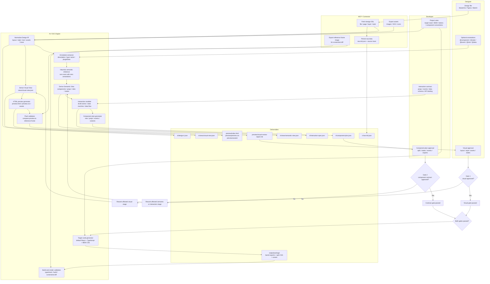

# Design Source To Component Architecture

## Decision

Use separate workflows for screenshot inputs and design-source inputs.

Screenshots are useful for structural understanding, state comparison, and skeleton generation, but they do not contain reliable style data. High-fidelity frontend generation should start from design-source systems that expose structured layout, text, style, component, and asset data.

Design-source workflows use one canonical normalized IR, then derive preview, semantic, interaction, and code-generation artifacts from it. The first implementation may still carry the shape of the first provider, but provider-neutrality is the target contract and must be refined as more providers are added.

The target output stack is controlled by project rules. The first default stack is React + TypeScript + BEM CSS.

The long-term workflow family is:

```text
design-to-component
  image-to-component          # Screenshot/image input, structure-first skeleton workflow
  sketch-to-component         # Sketch source provider
  figma-to-component          # Figma source provider
  mastergo-to-component       # MasterGo source provider
```

## D2C Fidelity Layers

Design-to-code has two distinct fidelity layers. They should be modeled and reviewed separately.

| Layer | Goal | Primary Inputs | Primary Outputs | Review Gate |
|---|---|---|---|---|
| Visual fidelity | Make the result look like the design | design DSL, layout, style, tokens, assets | `ir/views/visual-view.json`, `preview/index.html`, `preview/preview.css`, `preview/assets/` | HTML preview approval |
| Contract fidelity | Make the result usable as a maintainable component contract | annotations, layer names, project rules, developer contracts | `ir/views/semantic-view.json`, `ir/interaction-spec.json`, `ir/component-plan.json` | component plan approval |

Visual fidelity answers "does it look right?" Contract fidelity answers "is the generated component boundary, API, state, and event contract usable?"

Contract fidelity does not mean the generator implements business handlers. The engine may scaffold props, event names, payload shapes, and state-machine drafts, but the developer is authoritative for interaction semantics.

## Canonical IR Model

There is one canonical source of truth after extraction:

```text
ir/design-ir.json
```

`design-ir.json` is the normalized design IR. All other JSON outputs are derived views or downstream contracts.

```text
ir/
  raw-dsl.json                  # provider response, preserved for traceability
  design-ir.json                # canonical normalized IR
  views/
    visual-view.json            # derived view for preview rendering
    semantic-view.json          # derived view for component planning
  interaction-spec.json         # developer-authorized interaction contract
  component-plan.json           # approved code-generation plan
```

Placement rule:

- `views/` contains engine-derived projections from the canonical IR.
- top-level files under `ir/` are source data or developer-authorized contracts that gate generation.

Use these terms consistently:

| Term | Meaning |
|---|---|
| Raw DSL | Provider-specific data returned by MasterGo, Figma, Sketch, or another connector |
| Normalized Design IR | The canonical provider-normalized contract stored at `ir/design-ir.json` |
| Visual View | A derived view of the canonical IR used by the preview renderer |
| Semantic View | A derived view of the canonical IR used by component planning |
| Interaction Spec | A developer-authorized contract for events, payloads, state, and data |
| Component Plan | The final code-generation plan approved before target stack output |

`design-ir.json` must include a schema version:

```json
{
  "schemaVersion": "d2c.design-ir/v0.2.0",
  "source": {
    "provider": "sketch",
    "ref": { "fileName": "example.sketch", "documentId": "doc-1" },
    "rootName": "Example Screen"
  },
  "visual": {
    "artboard": { "width": 375, "height": 812 },
    "assets": [],
    "root": {
      "id": "node-root",
      "kind": "frame",
      "name": "ExampleScreen",
      "source": { "nodeId": "root-1", "originalType": "artboard", "provider": "sketch" },
      "layout": { "x": 0, "y": 0, "width": 375, "height": 812 },
      "children": []
    }
  },
  "semantic": { "candidates": [] },
  "interaction": {
    "status": "draft"
  },
  "warnings": []
}
```

Compatibility rule:

- Patch changes may add optional fields.
- Minor changes may add required fields only behind a migration path.
- Major changes may break old providers and must include a migration note.
- Pre-1.0 exception: while the major version is `0`, a minor bump is treated as breaking — `isCompatible` requires an exact major.minor match (patch is ignored). The patch/minor/major rules above take effect once major ≥ 1.
- Provider extractors must write the `schemaVersion` they target.

## End-To-End D2C Architecture

The first version should not depend on a low-code platform DSL. Instead, use design-source DSL for visual fidelity and annotations plus developer contracts for contract fidelity.

Semantic work can run in parallel with visual review, but final target-stack code generation is blocked until both gates pass.



Gate rejection returns to the narrowest affected stage. A visual rejection may rework only token mapping, asset export, or the Visual View; it does not require full DSL normalization unless the canonical IR is wrong. A contract rejection may rework only the Semantic View, Interaction Spec, or Component Plan.

## Responsibility And Deliverables

| Stage | Owner | Input | Deliverable |
|---|---|---|---|
| Design preparation | Designer | design file | accessible design source and exportable assets |
| Semantic annotation | Designer + developer | design file and business intent | optional `@component`, `@state`, `@event`, `@slot`, `@data` annotations |
| Project rule setup | Developer | target codebase conventions | stack rules, token mapping, BEM rules, export rules |
| DSL extraction | MCP / connector | design URL, file, page, or layer id | `ir/raw-dsl.json`, assets, reference frame image, source trace |
| IR normalization | D2C engine | raw DSL, assets, project tokens | `ir/design-ir.json` |
| Visual view derivation | D2C engine | canonical IR | `ir/views/visual-view.json` |
| HTML preview | D2C engine | Visual View derived from canonical IR | `preview/index.html`, `preview/preview.css`, `preview/assets/` |
| Visual review | Designer + developer | HTML preview and screenshot diff | `preview/visual-review-report.md` and Gate 1 approval |
| Semantic mapping | D2C engine + developer | canonical IR, annotations, project rules | `ir/views/semantic-view.json` |
| Interaction modeling | Developer + D2C engine | interaction contract and semantic view | `ir/interaction-spec.json` |
| Component planning | Developer + D2C engine | semantic view and interaction spec | `ir/component-plan.json` and Gate 2 approval |
| Code generation | D2C engine | approved component plan | target component package with barrel exports |
| Engineering validation | Developer + tools | generated code | typecheck, build, render, and screenshot-diff reports |

## Why Split These Workflows

`image-to-component` starts from pixels. A screenshot can show what a UI looked like, but it cannot reliably reveal:

- exact layout constraints;
- design tokens;
- font styles as named styles;
- component instances;
- layer names;
- exportable bitmap assets;
- vector source data;
- true spacing intent;
- design-system references.

Trying to make screenshot input produce high-fidelity production code pushes the workflow into guessing. That is still useful for component skeletons, but not enough for a design-source-grade implementation pipeline.

Design-source providers start from structured data. Sketch, Figma, and MasterGo can expose richer signals: layers, frames, constraints, text nodes, fills, strokes, tokens or styles, component instances, and asset references. These providers should feed the canonical Normalized Design IR, then use the same preview, contract planning, and target code generation stages.

## Workflow Roles

| Workflow | Input | Primary Output | Fidelity Goal |
|---|---|---|---|
| `image-to-component` | UI screenshots or mockup images | typed skeletons, state model, asset ledger | low to medium |
| `sketch-to-component` | Sketch file or Sketch MCP/IR | normalized design IR, preview, target component package | medium to high |
| `figma-to-component` | Figma API/MCP data | normalized design IR, preview, target component package | medium to high |
| `mastergo-to-component` | MasterGo DSL | normalized design IR, preview, target component package | medium to high |

## Shared Design-Source Pipeline

Every design-source provider should follow the same stages:

```text
Design Source
-> Provider Extractor
-> Normalized Design IR
-> HTML Preview Review Gate
-> Semantic View + Interaction Spec + Component Plan
-> Component Plan Review Gate
-> Target component package
```

### Provider Extractor

The provider extractor is the only layer that knows provider-specific details.

Examples:

- MasterGo extractor reads `MASTERGO_TOKEN`, parses `fileId` and `layerId`, and requests `/mcp/dsl`.
- Figma extractor would read Figma file/node data and export images where supported.
- Sketch extractor parses a `.sketch` file directly (an open ZIP of JSON), or later via SketchMCP.

Provider raw data must not be consumed directly by preview or target code generation.

### Provider Neutrality

`ir/design-ir.json` is the shared normalization target, but the first implementation is allowed to be influenced by the first provider's shape. Treat provider neutrality as an explicit migration goal, not as a claim already proven by one provider.

Rules:

- Do not copy provider-specific field names into downstream generators unless they are isolated under `source`.
- Keep provider-specific data under source metadata or trace records.
- When a second provider is implemented, extract provider-neutral concepts that both providers need.
- Provider docs must state which IR version and provider-specific assumptions they currently depend on.

### Normalized Design IR

Normalized Design IR is the common contract between extraction and generation. It should preserve:

- schema version;
- source metadata;
- page and frame structure;
- source-node trace ids;
- text content;
- layout and style data needed for preview;
- asset references;
- semantic component candidates;
- interaction scaffold status;
- warnings and lossy transformations;
- generated names for files, components, and BEM blocks.

Preview, semantic mapping, and code generation consume derived views from this canonical IR.

## Annotation And Semantic Fallback

Annotations improve contract fidelity, but they are not a hard prerequisite.

Zero-annotation runs must still work:

1. Infer semantic candidates from layer names, component instances, geometry, repeated groups, and text roles.
2. Assign confidence to each inferred component, prop, slot, state, and event.
3. Emit low-confidence items into `warnings`.
4. Require developer approval in Gate 2 before generating target-stack code.

Fallback behavior:

- Unknown visual nodes remain renderable in the preview through generic layout primitives.
- Unknown semantic regions become `GenericSection` candidates with warnings.
- Unknown events are not invented as approved handlers. They may appear only as draft suggestions.
- If the generator cannot infer a public component API, it must stop before target code generation and ask for Gate 2 input.

## Token Reconciliation

Token mapping is a core visual-fidelity variable and must be deterministic.

Mapping priority:

1. Explicit annotation or project rule mapping.
2. Provider style or token id mapped in project rules.
3. Exact value match against project tokens.
4. Threshold nearest-neighbor match marked as `pending`.
5. Literal value fallback marked with a warning.

Default thresholds:

- Color: exact match by normalized color value; nearest-neighbor candidates require a small perceptual delta and must stay `pending` until confirmed.
- Spacing and size: exact px/rem/token match first; nearest-neighbor candidates must stay `pending`.
- Radius and shadow: match named token families first; otherwise use literal fallback with warning.

The generator must not silently map a low-confidence raw value to a project token.

## Screenshot Diff Reference

Screenshot diff compares generated output against a provider-exported reference image.

Reference image rule:

- For design-source inputs, the reference image is the provider-exported frame or layer render.
- If the provider cannot export a reference image, the user must supply one or the screenshot-diff step is skipped with a warning.
- Do not compare against the original design DSL directly. Diff requires rendered pixels on both sides.

Default threshold policy:

- Pass: mismatch is within the configured tolerance and no critical asset is missing.
- Warn: mismatch is above tolerance but localized and explainable.
- Fail: mismatch is broad, blocks visual review, or hides missing layout, font, or asset data.

Exact thresholds should be configurable per project because font rendering, browser engine, and export pipeline differences vary.

## Error And Abort Semantics

The pipeline must distinguish partial output from fatal failure.

Fatal failures stop the run:

- design DSL cannot be fetched;
- target file, page, or layer id cannot be resolved;
- raw DSL cannot be parsed;
- canonical IR fails schema validation;
- node count exceeds the configured safety limit;
- Gate 1 or Gate 2 is rejected and no retry input is provided.

Recoverable failures produce partial output with warnings:

- individual asset export failures;
- token mapping fallback to literal values;
- unknown semantic component candidates;
- missing optional annotations;
- screenshot diff unavailable because no reference image exists.

Recoverable failures may generate preview output. They must not silently generate final target code if they affect public component contracts.

## Regeneration And Human Edits

Generated output should be treated as replaceable by default.

First-version rule:

- Generated package files are owned by the generator.
- Human edits should live in wrapper components, adapter files, or upstream project code outside the generated package.
- The generator must not overwrite an existing package unless the user passes an explicit overwrite option.
- Regeneration should create a new run directory or emit a change report before replacing generated output.

Design iteration flow:

```text
new design DSL
-> new raw-dsl.json
-> new design-ir.json
-> compare source node trace and component plan
-> emit change report
-> rerun preview and gates
```

Protected manual edit regions are not part of the first-version contract. Add them only after the generator has stable ownership and change-detection behavior.

## HTML Preview Gate

Design-source workflows must generate static HTML before target component output. The preview exists for developer and visual review.

Rules:

- Generate `preview/index.html`, `preview/preview.css`, and preview assets first.
- Include `preview/visual-review-report.md`.
- Compare preview screenshots against the provider-exported reference image when available.
- Stop before target code generation until Gate 1 has approved the preview.

Semantic extraction may run while Gate 1 is pending, but target code generation must wait for Gate 1 approval.

This prevents unapproved visual guesses from spreading across many component files.

## Interaction Spec Gate

HTML preview approval is not enough to generate maintainable components. After or alongside the visual gate, the workflow must produce an interaction spec and component plan before target code generation.

`interaction-spec.json` captures:

- component states;
- user events;
- event payloads;
- handler prop names;
- data models;
- state transitions when known;
- API or data binding notes;
- confidence and approval status.

Example:

```json
{
  "component": "ChatAssistantPage",
  "status": "draft",
  "states": ["idle", "loading", "error"],
  "events": [
    {
      "name": "submitMessage",
      "source": "InputComposer",
      "payload": { "text": "string" },
      "handlerProp": "onSubmitMessage",
      "confidence": "developer-provided"
    }
  ],
  "data": {
    "messages": "Message[]",
    "currentUser": "User"
  },
  "stateMachine": [
    { "from": "idle", "on": "submitMessage", "to": "loading" },
    { "from": "loading", "on": "submitSuccess", "to": "idle" },
    { "from": "loading", "on": "submitError", "to": "error" }
  ]
}
```

The engine may draft this file, but the developer owns approval. Gate 2 confirms component boundaries, props, slots, states, events, data contracts, and public exports.

### Interaction status and codegen mode

`interaction-spec.json` is a required artifact — codegen will refuse to run if the file is missing. Behavior is conveyed by an explicit `status` field, not by file absence:

| `status`     | Meaning                                                                                       | Passes Gate 2? |
| ------------ | --------------------------------------------------------------------------------------------- | -------------- |
| `draft`      | Engine-drafted, developer has not signed off                                                  | No             |
| `approved`   | Developer-reviewed full interaction contract                                                  | Yes            |
| `omitted`    | Developer-acknowledged that behavior is intentionally not modeled for this delivery           | Yes            |
| `deferred`   | Behavior modeling postponed to a later iteration; current delivery must be visual-only        | Yes            |

`omitted` and `deferred` both produce a presentational delivery. The distinction is intent: `omitted` says "we do not plan to add behavior to this package" (e.g., a sandbox-only artifact); `deferred` says "we will upgrade later". Both require a `reason` and an `approvedBy` field.

`component-plan.json` then carries a single `mode` field that codegen consumes:

```json
{
  "mode": "presentational",
  "interactionSpecRef": "ir/interaction-spec.json",
  "approval": {
    "gate": "gate-2",
    "level": "presentational",
    "acknowledgedBehaviorStubbed": true,
    "approvedBy": "<developer>"
  }
}
```

Allowed combinations:

| `interaction-spec.status` | `component-plan.mode` | Result                                           |
| ------------------------- | --------------------- | ------------------------------------------------ |
| `approved`                | `interactive`         | Full interactive package                         |
| `omitted` or `deferred`   | `presentational`      | Visual-only package, behavior stubbed            |
| any other pairing         | —                     | Schema error; pipeline refuses to enter Stage 6  |

Gate 2 remains a single gate. The approval record carries a `level` field (`presentational` or `interactive`) so tooling only has to ask "has Gate 2 passed?" while the contract retains the substance of what was approved.

Codegen consumes `component-plan.mode` only — it does not take an external mode parameter. Mode is a property of the approved plan, not a runtime switch.

#### Upgrade path

`presentational → interactive` is the highest-risk transition: optional placeholder props become required handlers, and every consumer's call sites may break. The upgrade rewrites the same `output/package/` directory in place so that the diff is reviewable, and **must re-run Gate 2** — the new approval record replaces the presentational one. Do not maintain parallel `output/package@presentational/` directories; a stale presentational copy on disk invites accidental imports.

## Target Package Output

After both gates pass, design-source workflows generate the target component package.

The target stack is selected by project rules. The first default output is React + TypeScript + BEM CSS.

`output/preview/` and `output/ir/` are sidecar pipeline artifacts. They are reviewable and should be preserved for traceability, but they are not the publishable component package. The publishable generated package lives under `output/package/`.

Default package requirements for React output:

- one page or root component directory;
- one `.tsx`, `.css`, `.types.ts`, and `index.ts` per component;
- per-component CSS files rather than one large stylesheet;
- page-level CSS only for layout composition;
- child component CSS for local structure, states, and variants;
- shared token files under package-root `styles/`;
- generated assets under package-root `assets/`;
- package-root barrel export;
- component and child component barrel exports;
- asset barrel export when assets are generated.

### Presentational package metadata

When `component-plan.mode === "presentational"`, the published package must surface that fact in four places. A single TODO file is not enough — readers and consumers will miss it.

1. **`package.json`** carries a `d2c` block:

   ```json
   {
     "d2c": {
       "mode": "presentational",
       "interactionStatus": "omitted",
       "generatedBy": "d2c-core@<version>"
     }
   }
   ```

2. **`README.md`** opens with a banner before any usage docs:

   > **This package is presentational / behavior-stubbed.** Interaction handlers and data bindings are placeholders. Do not import into business code without upgrading via the interactive Gate 2 flow.

3. **Each component file header** carries a comment:

   ```ts
   /**
    * D2C generated presentational component.
    * Behavior is stubbed; see ../interaction-coverage.md.
    */
   ```

4. **`interaction-coverage.md`** lives at the package root and enumerates the gaps:

   ```md
   ## Interaction coverage

   | Aspect       | Status   | Notes                                            |
   | ------------ | -------- | ------------------------------------------------ |
   | states       | omitted  | No state machine modeled                         |
   | events       | omitted  | Handler props are placeholders, never wired      |
   | dataBinding  | omitted  | Render data comes from defaultProps              |

   Approved by: <developer> at Gate 2 (presentational level).
   ```

The presentational flag is the single source of truth: `component-plan.mode` propagates to all four surfaces during generation; do not add redundant fields.

A follow-up `check:d2c-consumption` CI scan (Stage 8 backlog) will flag any business code that imports a presentational package; until then, the four-surface metadata is the only line of defense.

Recommended structure:

```text
output/
  preview/
    index.html
    preview.css
    assets/
    reference-frame.png
    visual-review-report.md

  ir/
    raw-dsl.json
    design-ir.json
    views/
      visual-view.json
      semantic-view.json
    interaction-spec.json
    component-plan.json

  package/
    assets/
      index.ts
      assistant-avatar.png
      send.svg

    styles/
      tokens.css
      variables.css

    components/
      ChatAssistantPage/
        index.ts
        ChatAssistantPage.tsx
        ChatAssistantPage.types.ts
        ChatAssistantPage.css

        components/
          ChatHeader/
            index.ts
            ChatHeader.tsx
            ChatHeader.types.ts
            ChatHeader.css

          MessageList/
            index.ts
            MessageList.tsx
            MessageList.types.ts
            MessageList.css

          InputComposer/
            index.ts
            InputComposer.tsx
            InputComposer.types.ts
            InputComposer.css

    index.ts
```

Root export:

```ts
export * from './components/ChatAssistantPage'
```

Page component export:

```ts
export { ChatAssistantPage } from './ChatAssistantPage'
export type { ChatAssistantPageProps } from './ChatAssistantPage.types'

export * from './components/ChatHeader'
export * from './components/MessageList'
export * from './components/InputComposer'
```

Child component export:

```ts
export { MessageList } from './MessageList'
export type { MessageItem, MessageListProps } from './MessageList.types'
```

Asset export:

```ts
export { default as assistantAvatar } from './assistant-avatar.png'
export { default as sendIcon } from './send.svg'
```

React output must use this package and barrel export shape. Avoid generating a single page `.tsx` file with one large CSS file.

## `image-to-component` Positioning

`image-to-component` remains valuable, but its contract should be explicit:

- It is structure-first.
- It compares screenshots and states.
- It models props and variants.
- It can produce usable skeleton code.
- It can optionally collect coarse style hints.
- It must not promise design-source fidelity.

When a user needs accurate visual reconstruction and can provide Sketch, Figma, or MasterGo source data, route them to the design-source pipeline instead.

## Migration Path

1. Reposition `image-to-component` as screenshot-to-skeleton in its `SKILL.md`.
2. Keep its existing structural comparison, signature validation, prop modeling, and asset-ledger strengths.
3. **Sketch is the first complete-vertical-slice provider** (confirmed 2026-05-21, after Stage 2 raw extraction proved out): it carries raw extraction and `normalize`. `.sketch` is an open, local, inspectable format, so the pipeline is developed and tested offline.
4. Implement `ir/design-ir.json` as the canonical normalized IR target for the first provider that reaches `normalize`, documenting any provider-specific assumptions.
5. Extract stronger provider-neutral concepts only after a second provider proves what is actually shared.
6. Restore MasterGo as a provider once its server-side raw DSL contract can be obtained reliably; add Figma later. Every new provider must respect the IR versioning, preview gate, contract gate, and regeneration behavior.
