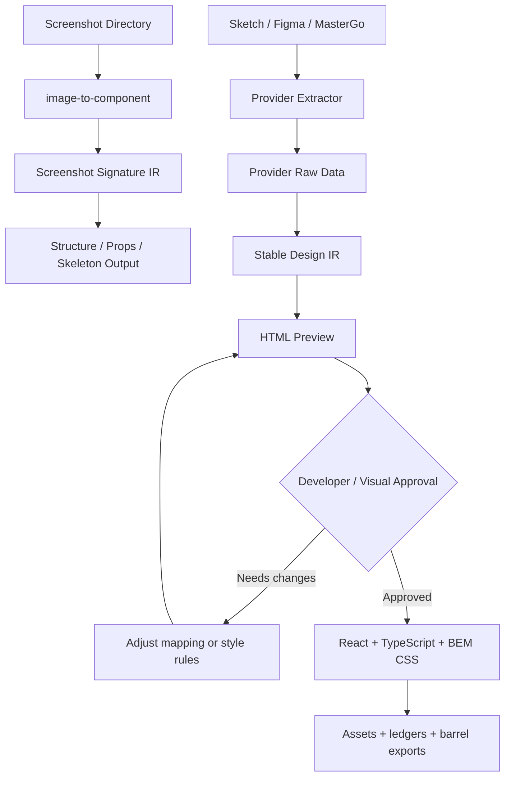

# Design Source To Component Architecture

## Decision

Use separate workflows for screenshot inputs and design-source inputs.

Screenshots are useful for structural understanding, state comparison, and skeleton generation, but they do not contain reliable style data. High-fidelity frontend generation should start from design-source systems that expose structured layout, text, style, component, and asset data.

The long-term architecture is:

```text
design-to-component
├── image-to-component          # Screenshot/image input, structure-first skeleton workflow
├── sketch-to-component         # Sketch source provider
├── figma-to-component          # Figma source provider
└── mastergo-to-component       # MasterGo source provider
```

## Architecture



## Why Split These Workflows

`image-to-component` starts from pixels. A screenshot can show what a UI looked like, but it cannot reliably reveal:

- exact layout constraints;
- design tokens;
- font styles as named styles;
- component instances;
- layer names;
- exportable bitmap assets;
- vector source data;
- true spacing intent;
- design-system references.

Trying to make screenshot input produce high-fidelity production code pushes the workflow into guessing. That is still useful for component skeletons, but not enough for a design-source-grade implementation pipeline.

Design-source providers start from structured data. Sketch, Figma, and MasterGo can expose richer signals: layers, frames, constraints, text nodes, fills, strokes, tokens or styles, component instances, and asset references. These providers should feed a shared Stable Design IR, then use the same preview and React generation stages.

## Workflow Roles

| Workflow | Input | Primary Output | Fidelity Goal |
|---|---|---|---|
| `image-to-component` | UI screenshots or mockup images | typed skeletons, state model, asset ledger | low to medium |
| `sketch-to-component` | Sketch file or Sketch MCP/IR | design-source IR, preview, React package | medium to high |
| `figma-to-component` | Figma API/MCP data | design-source IR, preview, React package | medium to high |
| `mastergo-to-component` | MasterGo DSL | design-source IR, preview, React package | medium to high |

## Shared Design-Source Pipeline

Every design-source provider should follow the same stages:

```text
Design Source
-> Provider Extractor
-> Stable Design IR
-> HTML Preview Review Gate
-> React + TypeScript + BEM CSS component package
```

### Provider Extractor

The provider extractor is the only layer that knows provider-specific details.

Examples:

- MasterGo extractor reads `MASTERGO_TOKEN`, parses `fileId` and `layerId`, and requests `/mcp/dsl`.
- Figma extractor would read Figma file/node data and export images where supported.
- Sketch extractor would read a committed Sketch IR or talk to SketchMCP.

Provider raw data must not be consumed directly by React generation.

### Stable Design IR

Stable Design IR is the common contract between extraction and generation. It should preserve:

- source metadata;
- page and frame structure;
- semantic component candidates;
- text content;
- layout and style data needed for preview;
- asset references;
- warnings and lossy transformations;
- generated names for files, components, and BEM blocks.

Both HTML preview and React generation consume this IR.

### HTML Preview Gate

Design-source workflows must generate static HTML before React output. The preview exists for developer and visual review.

Rules:

- Generate `preview/index.html` and `preview.css` first.
- Include preview assets and a preview ledger.
- Stop after preview generation.
- Do not generate React until the user explicitly confirms that the preview style is acceptable.

This prevents unapproved visual guesses from spreading across many component files.

### React Package Output

After approval, design-source workflows generate React + TypeScript + BEM CSS.

Default package requirements:

- one page or root component directory;
- one `.tsx`, `.css`, and `index.ts` per child component;
- per-component CSS files rather than one large stylesheet;
- `types.ts` for public types;
- `data.ts` for extracted sample content;
- `assets/images/` and `assets/icons/`;
- `asset-ledger.md`;
- root barrel export;
- child component barrel exports.

## `image-to-component` Positioning

`image-to-component` remains valuable, but its contract should be explicit:

- It is structure-first.
- It compares screenshots and states.
- It models props and variants.
- It can produce usable skeleton code.
- It can optionally collect coarse style hints.
- It must not promise design-source fidelity.

When a user needs accurate visual reconstruction and can provide Sketch, Figma, or MasterGo source data, route them to the design-source pipeline instead.

## Migration Path

1. Reposition `image-to-component` as screenshot-to-skeleton in its `SKILL.md`.
2. Keep its existing structural comparison, signature validation, prop modeling, and asset-ledger strengths.
3. Treat `mastergo-to-component` as the first design-source provider.
4. Extract shared concepts into provider-neutral references once a second provider exists.
5. Add Figma and Sketch providers only after the MasterGo provider proves the shared IR and preview gate.
