# 设计源到组件(D2C)— 项目概览

> 面向非技术读者的一页纸说明。技术细节见
> [架构总纲](./design-source-to-component-architecture.md) 与
> [实施计划](./design-source-to-component-implementation-plan.md)。
> 更新:2026-05-22

## 一句话

把**设计师的设计稿**自动变成**前端代码**的一条流水线 —— 设计稿进、代码出,中间设两道人工
检查关卡。目标:把"工程师照着设计稿一行行手写代码"这件**又慢又容易出错**的事,变成
**分钟级、可复用、可控**。

## 类比:一条工厂流水线

- **原料** = 设计稿(来自 Sketch / Figma / MasterGo 等不同设计软件)。
- **成品** = 能直接用的前端代码。
- 今天这条产线是**纯手工**:工程师对着设计稿敲,一个屏幕要敲好几天,还常和设计对不上。
- 我们做的是把它**自动化**。关键巧思:中间加一种**统一标准格式** —— 不管原料来自哪个设计
  软件,先统一转成它,后面的产线只造一次,就能服务所有设计软件。接入一个新设计工具,只需补
  一个"读取头",不必重建整条线。

## 全局流程与进度

```mermaid
flowchart LR
  src(["设计稿来源<br/>Sketch / Figma / MasterGo"])
  s1["① 读取设计数据 ✅"]
  s2["② 转成统一标准格式 ✅<br/>★ 整条线的地基 · 最难一环"]
  s3["③ 生成可视预览 🔨 在建"]
  g1{{"✋ 人工关卡①<br/>看着对吗?"}}
  s4["④ 分析出组件结构 ⬜"]
  g2{{"✋ 人工关卡②<br/>组件能用吗?"}}
  s5["⑤ 生成前端代码 ⬜"]
  s6["⑥ 自动校验 ⬜"]
  out(["前端代码<br/>React 组件"])
  src --> s1 --> s2 --> s3 --> g1 --> s4 --> g2 --> s5 --> s6 --> out
  classDef done fill:#d4edda,stroke:#28a745,color:#155724
  classDef build fill:#fff3cd,stroke:#e0a800,color:#856404
  classDef todo fill:#e9ecef,stroke:#adb5bd,color:#495057
  classDef gate fill:#fde2e4,stroke:#e07a86,color:#6b2e36
  classDef io fill:#e7f1ff,stroke:#4a90d9,color:#1c3d5a
  class src,out io
  class s1,s2 done
  class s3 build
  class s4,s5,s6 todo
  class g1,g2 gate
```

`✅ 已完成 ｜ 🔨 在建 ｜ ⬜ 待做`

## 当前进度

- **地基已搭好**:"统一标准格式"已定义,并用 **70+ 个自动化测试**守住质量。
- **前半段已跑通**:今天已能拿一个**真实设计稿文件**,自动跑完 ①读取 + ②标准化 —— 杂乱的
  设计数据被规整成统一格式。**这一段技术上最难,已经啃下来了。**
- **正在做**:③生成可视预览 —— 完成后即可现场演示"设计稿 → 网页预览",并迎来第一道人工关卡。
- **后面**:④组件分析(第二道关卡)→ ⑤生成代码 → ⑥自动校验。

## 为什么这么做(价值)

| 关注点 | 我们的答案 |
|---|---|
| 省钱 / 提速 | 设计稿到代码:从"手写数天"→"流水线分钟级 + 人工把关" |
| 能否复用 | 中间统一格式 → 一次建线,Sketch / Figma / MasterGo 都能接 |
| 风险 | **不是黑箱全自动**:两道人工关卡,人始终在环,出错能拦住 |
| 靠谱度 | 分阶段交付,每阶段都有可验证产物 + 自动化测试,不是 PPT 工程 |

## 汇报开场白(可照着说)

> "我们在把'设计稿变代码'这件事自动化。用一条流水线来比喻:设计稿是原料,前端代码是成品,
> 中间有两道人工检查。**目前流水线的输入和标准化已经跑通 —— 也就是最难的地基已完成**,现在
> 拿一个真实设计稿能自动转成标准格式。下一步打通'可视预览',到时可现场演示设计稿变网页。
> 整条线分阶段做,每段都有测试守着,稳扎稳打。"
