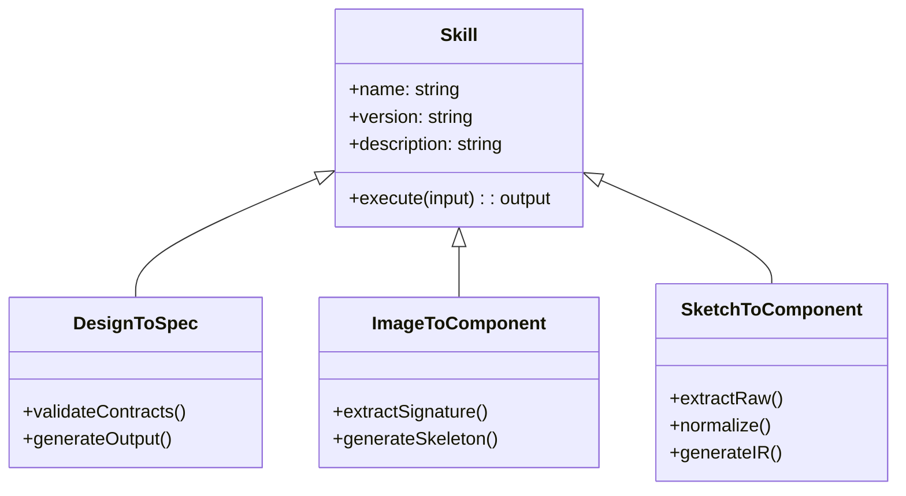
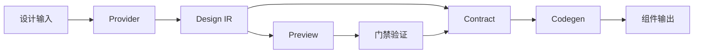

# 领域模型

## 核心概念

### Skill

AI能力的基本单元，每个skill解决特定的设计转换问题。

### Design IR (中间表示)

统一的设计描述格式，作为各种输入源的标准化输出。

**位置**：`packages/d2c-core/src/ir/`

**核心属性**：

- 视觉层次结构
- 布局约束关系
- 样式属性集合
- 交互行为定义

### Provider (设计源适配器)

将不同格式的设计输入标准化为Design IR的适配器接口。

**位置**：`packages/d2c-core/src/provider/`

**实现**：

- SketchProvider：处理.sketch文件
- ImageProvider：处理截图/图片
- HTMLProvider：处理HTML源码

### Contract (组件契约)

定义组件API、状态管理和数据流的规范化描述。

**位置**：`packages/d2c-core/src/contract/`

**组成**：

- UI Schema：界面结构定义
- API Schema：数据接口规范
- Mapping Logic：UI与API绑定关系

### Workspace (工作区)

项目组织和依赖管理的上下文环境。

**特征**：

- npm workspaces结构
- 分层的package依赖
- 统一的脚本管理

## 领域关系

## 数据流转

1. **输入阶段**：多格式设计源 → Provider适配
2. **标准化阶段**：Design IR生成和验证
3. **预览阶段**：HTML可视化和保真度检查
4. **契约阶段**：组件API和状态定义
5. **生成阶段**：目标框架代码输出

## 扩展模型

新skill集成遵循固定模式：

1. 实现Provider接口
2. 定义特定的IR扩展
3. 配置预览管线
4. 实现测试用例
