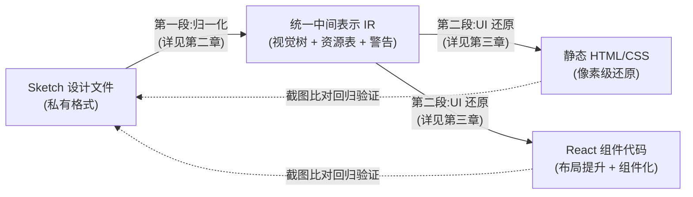
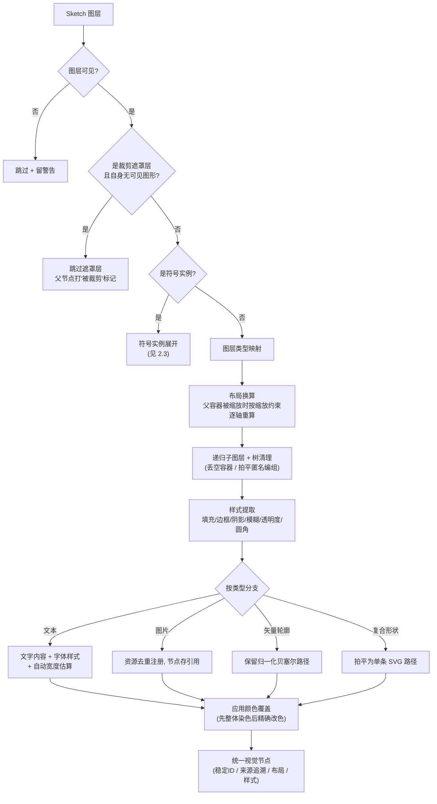
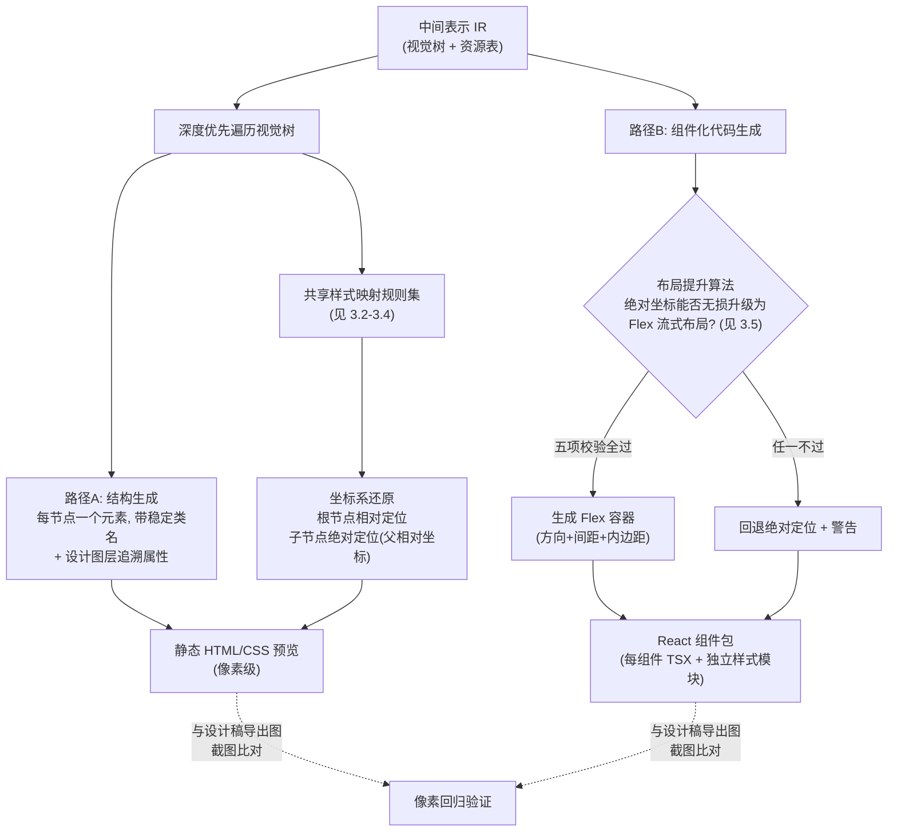

# 设计稿归一化与前端 UI 还原方法 —— 核心技术方案

> 整理日期：2026-06-10。本文为专利申请准备的技术方案描述底稿，聚焦两段核心流程：
> ① 将 Sketch 设计文件**归一化**为统一中间表示；② 从中间表示**还原**出高保真前端 UI。
> 其余工程流程（人工审批、产物管理等）均已略去。
> 注：本文是技术交底素材，正式申请前仍需由专利代理人改写为权利要求书与说明书。

## 名词解释

| 名词                        | 解释                                                                                                                                                 |
| --------------------------- | ---------------------------------------------------------------------------------------------------------------------------------------------------- |
| **归一化 / 中间表示（IR）** | 把设计工具的私有数据格式翻译成的一份**与工具无关的标准化中间数据**。它完整描述一个界面的层级结构、几何、样式、文字与资源，是后续 UI 还原的唯一输入。 |
| **画板（Artboard）**        | 设计工具中一块固定尺寸的设计区域，对应一个完整页面或屏幕。                                                                                           |
| **符号（Symbol）**          | Sketch 的可复用组件机制：先定义**主控（master）**模板，再放置其**实例（instance）**；实例可局部修改文字、颜色，这些修改称为**覆盖项（overrides）**。 |
| **视觉树**                  | 归一化产出的层级结构：每个节点记录类型、位置尺寸、样式、文字或资源引用，以及指回原始设计图层的追溯信息。                                             |
| **缩放约束**                | Sketch 为每个图层存储的 6 位编码，描述容器尺寸变化时该图层如何跟随（四边是否钉住、宽高是否固定）。                                                   |
| **贝塞尔路径**              | 用锚点和控制点描述曲线轮廓的矢量表达方式。                                                                                                           |
| **绝对定位 / 流式布局**     | 前端两种排版方式。绝对定位按固定坐标摆放（精确但僵硬）；流式布局（如 Flex 弹性盒）由浏览器按规则自动排列（可维护但可能偏离设计稿）。                 |
| **确定性输出**              | 同样的输入永远产出逐字节一致的结果，是本方案可验证、可回归测试的基础。                                                                               |

## 一、整体技术方案

**要解决的技术问题**：设计稿转前端代码的现有方案，要么依赖截图像素猜测（无法获得精确布局与样式），要么直接耦合单一设计工具的私有格式（不可移植、不可验证）。设计工具中大量**隐式语义**（组件实例与覆盖项、缩放约束、文本填充即文字色、顶点上的圆角等）在转换中丢失，导致还原失真。

**本方案的核心思路**：分两段解决——

- **第一段（归一化）**：把 Sketch 私有格式中的隐式语义逐项**显式化**，翻译成一份工具中立、确定性、可追溯的中间表示；
- **第二段（UI 还原）**：从中间表示出发，用一组确定性的映射规则还原为前端 UI，并通过**布局提升算法**在保真前提下把僵硬的绝对坐标升级为可维护的流式布局。



两段之间只通过中间表示衔接，互不感知对方实现；中间表示带版本号和内容指纹，任一段升级都可独立验证。

## 二、第一段：Sketch 设计文件的归一化方法

### 2.1 算法核心思想与骨架

归一化算法的本质可以一句话概括：

> **一次携带全局上下文的确定性深度优先树转换** —— 以"符号展开、约束重算、覆盖下发"三大上下文贯穿递归，把 Sketch 私有格式中的隐式约定逐条翻译成显式数据；拿不准的降级留痕，错得离谱的快速失败。

算法骨架（伪代码）：

```text
输入: Sketch 原始设计数据 (JSON)
输出: 设计 IR (视觉树 + 资源表 + 语义候选 + 警告列表)

步骤 1  入参校验    原始数据过结构校验, 失败立即终止
步骤 2  画板选择    枚举画板候选, 排除纯符号库页;
                    唯一候选 → 自动选中; 多候选 → 要求显式指定, 绝不猜测
步骤 3  符号索引    预建 符号ID → 主控模板 查找表 (含外部组件库符号)
步骤 4  视觉树构建  root = normalize(画板, 上下文, 初始选项)   ← 递归主体
步骤 5  语义派生    按符号实例 / 图层命名 / 重复结构三类信号标注组件候选
        出口校验    产出的 IR 整体再过一次结构校验, 不合格抛错

normalize(node, ctx, opt):                      # 递归主体, 每节点六道工序
  ① 过滤    不可见 → 跳过+警告; 纯裁剪遮罩 → 跳过, 父节点打"被裁剪"标记
  ② 分流    符号实例 → 展开分支(见 2.3); 其余按类型映射表归类
  ③ 几何    读取坐标; 父容器被缩放时按缩放约束逐轴重算(见 2.3-2)
  ④ 递归    normalize 每个子图层 + 树清理(丢空容器/拍平匿名编组)
  ⑤ 提取    样式(填充/边框/阴影/模糊/透明度/圆角)
            + 按类型: 文本内容与字体 / 图片资源注册 / 贝塞尔路径 / 复合形状拍平
  ⑥ 覆盖    应用颜色覆盖项: 先整体染色(tint), 后按序号精确改色
  返回 统一视觉节点 (稳定ID / 来源追溯 / 布局 / 样式 / 子节点)
```

递归之上叠加四个核心子算法，是本方法技术含量的主要载体：

| 子算法             | 解决的问题                      | 核心手段                                                   | 详见  |
| ------------------ | ------------------------------- | ---------------------------------------------------------- | ----- |
| ① 作用域化稳定 ID  | 符号展开后同源图层 ID 碰撞      | hash(实例链 ‖ 原始ID) 取 64 位                             | 2.3-1 |
| ② 缩放约束逐轴重算 | 实例与主控尺寸不一致            | 6 位约束解码 + 双轴独立八情形公式 + 逐层传递               | 2.3-2 |
| ③ 覆盖项路径下发   | 实例的局部修改要送达深层目标    | 随递归逐层剥离路径前缀; tint 沿子树传播、"先泛后精"        | 2.3-4 |
| ④ 隐式语义显式化   | Sketch 各处隐式约定导致还原失真 | 一组确定性翻译规则(文本填充分离、圆角归位、自动宽度修正等) | 2.4   |

两条贯穿性原则：**确定性**（稳定哈希 ID、警告固定排序、坐标定点舍入 → 同输入逐字节同输出，支撑回归验证）与**分级容错**（可恢复问题降级留痕、结构性问题快速失败，详见 2.5）。

以下各节展开细节。

### 2.2 节点递归归一化

对每个 Sketch 图层按以下决策流程翻译为统一视觉节点：



**图层类型映射**：画板/容器/符号主控 → 框架；编组 → 分组；文本 → 文本；位图 → 图片；路径/圆/矩形/复合形状 → 形状；SVG 类 → 矢量；**无法识别的类型降级为分组并留警告，不中断流程**。

**裁剪遮罩的近似处理**：Sketch 的遮罩层为兄弟图层定义几何裁剪，自身不可见。方案是：纯遮罩层跳过、父节点打"被裁剪"标记，还原时用容器裁剪（overflow:hidden）近似；若遮罩层自身还承载可见图形（带填充/描边/阴影），则保留该图形，只放弃其遮罩语义——避免主图形丢失。

### 2.3 符号实例展开（归一化的关键难点）

符号实例在设计文件中只是"一个引用 + 一组覆盖项"，归一化时必须把主控模板内容**完整内联展开**，同时解决四个问题：

**（1）展开后的 ID 唯一性。** 同一主控被放置多次时，模板内部子图层 ID 会在每个实例中重复。方案：维护"从根到当前实例的实例链"，将实例链与原始图层 ID 拼接后哈希，生成 64 位稳定唯一 ID——同一输入永远得到同一 ID（确定性），不同实例的同源图层必然不同（唯一性），容量可支撑数十亿节点。符号之外的普通节点直接沿用原始 ID 规范化形式，保证既有结果不受影响。

**（2）实例与主控尺寸不一致时的子图层重算。** 解码 6 位缩放约束（左/右/上/下边钉住、宽/高固定，置位表示自由），水平、垂直两轴**各自独立**套用八情形重算公式：

| 起始边 | 结束边 | 尺寸 | 重算规则                      |
| ------ | ------ | ---- | ----------------------------- |
| 钉住   | 钉住   | 固定 | 过约束 → 起始边优先，保持原值 |
| 钉住   | 钉住   | 弹性 | 位置不变，尺寸吸收容器差值    |
| 钉住   | 自由   | 固定 | 位置、尺寸都不变              |
| 钉住   | 自由   | 弹性 | 位置不变，尺寸按容器比例缩放  |
| 自由   | 钉住   | 固定 | 位置平移容器差值，尺寸不变    |
| 自由   | 钉住   | 弹性 | 尺寸按比例缩放，位置保持尾距  |
| 自由   | 自由   | 固定 | 中心点按比例移动，尺寸不变    |
| 自由   | 自由   | 弹性 | 位置、尺寸都按比例缩放        |

带旋转/翻转的图层超出平面公式能力，记录警告而非给出错误结果。重算具有**传递性**：被缩放节点的子节点继续按各自约束重算，逐层传播。

**（3）循环引用防护。** 沿展开路径记录已访问符号集合，符号自嵌套（A 含 B、B 含 A）时停止展开并留警告，保证算法必然终止。

**（4）覆盖项的逐层路径下发。** Sketch 把"这个实例改了什么"编码为带层级路径的键值对（如 `图层A/图层B_属性名`）。方案：解析路径后随递归**逐层剥离前缀**——每下降一层剥掉一段，路径剥空即送达目标节点。支持四类覆盖，并规定了确定性的应用顺序：

- **文字覆盖**：替换目标文本节点的内容；
- **换符号**：把嵌套子符号整体替换为另一个主控（先换再展开）；
- **整体染色（Tint）**：广义染色覆盖，**沿整棵子树持续传播**——文本节点改文字色，形状节点改全部填充色；每个后代在自身归一化时重新评估染色，避免"父级染色回头抹掉子级精确覆盖"；
- **按序号精确改色**：指定第 N 个填充/第 N 个边框的颜色。应用顺序固定为"**先整体染色、后精确改色**"，保证更具体的设置最终生效。

### 2.4 样式与文本的隐式语义显式化

这是归一化阶段保真度的主要来源——把 Sketch 各处的隐式约定翻译成显式、自洽的数据：

- **颜色统一**：0–1 浮点 RGBA 四通道 → 8 位十六进制（含透明度），全管线唯一颜色表示。
- **文本填充语义分离**：Sketch 文本图层的"填充"实为**文字颜色**而非背景色。纯色填充归入文字样式并从节点样式剔除（否则还原时会把文字画成色块）；**渐变/图片填充保留在节点样式上**，供还原阶段渲染渐变镂空文字（见 3.3）。
- **字体名解析**：形如 `Helvetica-Bold` 的字体名按末段后缀查权重表拆为"字体族 + 数值粗细"，仅在精确命中已知粗细词时才拆分，不做猜测。
- **圆角按几何位置归位**：Sketch 把四角圆角值存在路径顶点上，顶点数组顺序可能被编辑打乱。方案：按每个顶点的**归一化坐标**（{0,0}/{1,0}/{1,1}/{0,1}，带浮点容差）判定其所属角位；判定失败才回退数组顺序并留警告；四角相等折叠为单值。
- **自动宽度文本修正**：标记为"自动宽度"的单行文本，设计文件存储的只是设计时快照宽度。方案：按字符类型估算真实宽度（中日韩字符记全字号宽、大写字母与数字记 0.65 倍、其余 0.55 倍、空白 0.35 倍），估算值超过快照宽度则放大节点并打"自动宽度"标记；同时联动父容器——同一行兄弟节点依原始间距右移、与容器同尺寸的满宽背景同步拉伸，消除文字溢出与遮挡。
- **矢量轮廓保真**：不规则形状保留**归一化（0–1）贝塞尔路径点**（锚点 + 两侧控制点 + 闭合标志），坐标四舍五入到 6 位小数保证逐字节确定；复合形状（多个子形状布尔运算的组合）按各子形状的相对偏移与旋转，**拍平为单条绝对坐标 SVG 路径**，含减法运算时标记"镂空"填充规则（evenodd），并清空子树避免重复渲染。
- **图片资源引用化**：节点只保存去重后的资源引用，真实图片字节单独镜像存储，按引用关联——中间表示保持轻量且可序列化比对。
- **结构降噪**：丢弃无样式无内容的空容器；拍平设计师随手打组产生的匿名透传分组（"编组/Group N"），降低还原结果的无效嵌套。

### 2.5 容错与可追溯设计

- **降级不中断**：隐藏图层、未知类型、缺失资源、缺失主控等可恢复问题一律降级处理并记入警告列表；警告按固定键排序，保证输出确定性。
- **快速失败**：画板缺失、数据解析失败、出口校验不过——立即报错终止，不带病进入还原阶段。
- **全程追溯**：每个视觉节点保留来源三元组（原始图层 ID、图层名、原始类型），可从最终 UI 反查到设计稿中的具体图层。

## 三、第二段：从中间表示还原前端 UI

UI 还原算法的核心思想一句话概括：

> **以中间表示为唯一输入的确定性渲染规则求值** —— 再走一次深度优先遍历，对每个视觉节点套用同一套"属性 → 前端表达"的映射规则；坐标系直通（归一化已折算完所有变换，无二次换算）；布局升级遵循"**保真优先**"原则——只有能数学证明视觉不漂移时，才把绝对坐标提升为流式布局，否则保持绝对定位。

UI 还原有两条并行的目标路径，共享同一套样式映射规则：**路径 A** 产出静态 HTML/CSS（用于像素级视觉验证），**路径 B** 产出 React 组件代码（用于工程集成）。两条路径都是纯函数式的确定性转换。



### 3.1 结构与坐标系还原

- 视觉树与 DOM 树**一一对应**：每个视觉节点生成一个元素，类名由节点稳定 ID 派生（确定性），元素上附带指向原始设计图层的追溯属性——从浏览器审查任意元素可直接定位到 Sketch 图层。
- **坐标系还原**：根节点设为相对定位锚点，所有后代按归一化阶段算好的"父相对坐标"绝对定位。由于归一化已把符号缩放、约束重算全部折算进坐标，此处无需任何二次换算。

### 3.2 样式映射规则集（两条路径共享）

| 中间表示属性 | 还原规则         | 特殊处理                                                                                                                                  |
| ------------ | ---------------- | ----------------------------------------------------------------------------------------------------------------------------------------- |
| 纯色填充     | 背景色           | 文本/矢量类节点不画盒背景（避免色块遮文字、双重渲染）                                                                                     |
| 线性渐变填充 | CSS 线性渐变     | 由起止点向量反算角度（atan2），色标按位置排序输出                                                                                         |
| 边框         | CSS 边框         | **亚像素内描边剔除**：厚度 <1px 且位置为"内侧"的描边在设计工具中视觉上可忽略，但 CSS 盒模型会画出可见接缝（如气泡主体与尾部之间），故跳过 |
| 阴影/内阴影  | box-shadow       | 偏移、模糊、扩展、颜色逐项映射                                                                                                            |
| 图层模糊     | filter: blur     | 半径 ≤0 的无效配置在归一化时已剔除                                                                                                        |
| 圆角         | border-radius    | 单值或四角分别输出                                                                                                                        |
| 透明度       | opacity          | 直接映射                                                                                                                                  |
| "被裁剪"标记 | overflow: hidden | 仅被标记的容器裁剪，普通容器保持可见溢出（不误伤下拉、气泡尾等合法溢出）                                                                  |

### 3.3 文本还原

- **自动宽度文本** → `width: max-content` + 禁止换行：交还浏览器做真实排版，归一化阶段的估算宽度只兜底布局联动；固定宽度文本 → 保留换行（pre-wrap）。
- 字体族、字号、数值字重、固定行高、对齐逐项映射。
- **渐变镂空文字**：当文本节点带渐变填充（归一化阶段特意保留的），用"背景渐变 + 裁剪到文字 + 前景透明"（background-clip: text）的组合渲染出渐变文字；径向/角度渐变等不支持的类型回退为实色文字，绝不静默错色。

### 3.4 矢量与图片还原

- **矢量轮廓**：归一化的 0–1 贝塞尔路径按节点实际宽高缩放，生成内联 SVG（viewBox 即节点尺寸）；锚点任一侧带控制点即生成三次贝塞尔段，否则直线段；闭合路径补回环段。填充支持渐变（生成 SVG 渐变定义并引用），失败回退实色。
- **复合形状**：归一化阶段拍平的单条路径直接作为 SVG path 输出，按需带镂空填充规则。
- **图片双轨渲染**：能解析到真实图片字节时按"完整包含、不裁切"（contain）方式渲染原图；解析不到时生成**自描述占位图**——一张标注资源 ID 与目标尺寸的 SVG，让缺失资源在视觉验证中一眼可辨，而不是空白或报错。

### 3.5 布局提升算法（绝对定位 → 流式布局的无损升级）

静态坐标还原虽然像素精确，但生成的代码不可维护（改一处要重算所有坐标）。本方案的关键步骤是：在**可证明不损失保真度**的前提下，把一组绝对定位的兄弟节点提升为 Flex 流式布局；证明不了就保持绝对定位。

提升判定对候选容器的子节点矩形序列执行**五项校验**（容差 0.5px）：

1. **数量校验**：至少两个子节点，且全部携带几何信息；
2. **顺序校验**：子节点的文档顺序必须与主轴（纵向堆叠取 y、横向排列取 x）坐标顺序一致——流式布局按文档顺序排列，顺序不符必然错位；
3. **无重叠校验**：相邻子节点的主轴间隙均不为负——Flex 无法表达重叠；
4. **间距重建校验**：取所有间隙的均值作为统一间距（gap），从首个子节点开始用"尺寸 + 均值间距"逐个重建主轴位置，任一节点重建位置与真实位置偏差超过 0.5px 即判失败——保证用单一 gap 表达后视觉不漂移；
5. **跨轴对齐校验**：所有子节点的跨轴起点一致（0.5px 内）——对应 Flex 的起点对齐。

判定算法（伪代码）：

```text
输入: 容器的子节点矩形序列 rects[0..n-1], 排列方向 strategy(纵向堆叠|横向排列)
输出: Flex 投影参数 { 方向, 统一间距 gap, 内边距 } 或 回退绝对定位(附原因)

主轴坐标 main(r)  = strategy 为纵向 ? r.y : r.x
主轴尺寸 size(r)  = strategy 为纵向 ? r.height : r.width
跨轴坐标 cross(r) = strategy 为纵向 ? r.x : r.y
容差 TOL = 0.5px

if n < 2 或 任一 rect 缺失           → 回退("子节点不足或缺几何")
if 文档顺序 ≠ 按 main() 排序的顺序    → 回退("顺序与主轴不符")
gaps[i] = main(rects[i]) - (main(rects[i-1]) + size(rects[i-1]))
if 任一 gap < 0                      → 回退("子节点重叠")
gap = mean(gaps)                      # 均值作为统一间距
pos = main(rects[0])
for i in 1..n-1:                      # 用 尺寸+均值间距 重建主轴位置
    pos += size(rects[i-1]) + gap
    if |pos - main(rects[i])| > TOL  → 回退("均值间距重建漂移超容差")
if 任一 |cross(rects[i]) - cross(rects[0])| > TOL
                                     → 回退("跨轴起点不齐")
return { 方向: strategy 对应的 列|行, gap,
         内边距: 首子节点偏移 (rects[0].x, rects[0].y) }
```

五项全部通过，输出 Flex 投影参数：方向（列/行）、均值间距、首子节点偏移转化的内边距；**任一不通过则回退绝对定位并附带可读原因**。该算法的设计原则是：**布局升级永远不以牺牲视觉保真为代价**，可维护性只在免费时获取。

### 3.6 组件化输出与还原闭环

- 路径 B 把视觉树按组件边界切分，每个组件生成独立的代码文件与样式模块；样式类名由语义节点 ID 哈希派生，跨组件不冲突；图片资源解析为包内相对引用，必需资源缺失时立即报错而非生成占位。
- 生成的每个 DOM 节点保留设计图层追溯属性，与路径 A 的预览节点一一对应——同一标识贯穿"设计图层 → 中间表示 → 预览元素 → 组件代码元素"全链路。
- **验证闭环**：两条路径的产物都可与设计工具导出的参考图做像素级截图比对；由于全链路确定性（稳定 ID、排序输出、坐标定点舍入），任何回归都能精确定位到引入它的环节。

## 四、核心创新点清单（供权利要求提炼）

**归一化侧：**

1. 符号实例展开中以"实例链 + 原始图层 ID"哈希生成作用域化稳定节点 ID 的方法（解决展开 ID 碰撞，且保持确定性）；
2. 基于缩放约束位编码的逐轴八情形重算方法及其在嵌套展开中的传递应用；
3. 覆盖项按层级路径逐层剥离下发、整体染色沿子树传播且"先泛后精"的确定性应用顺序；
4. 文本填充语义分离：纯色归文字样式、渐变保留供镂空文字还原的双轨处理;
5. 圆角值按顶点归一化坐标归位（而非依赖数组顺序）的容错提取方法；
6. 自动宽度文本的字符类估宽 + 兄弟节点联动重排 + 满宽背景同步拉伸；
7. 复合形状拍平为单条带镂空规则的绝对坐标矢量路径；
8. 裁剪遮罩降级为容器裁剪近似、可见图形遮罩保图形弃语义的分类处理；
9. "可恢复问题降级留痕、结构问题快速失败"的确定性容错体系。

**UI 还原侧：**

10. 绝对定位到流式布局的**保真受控提升算法**：顺序/重叠/均值间距重建/跨轴对齐多项校验 + 像素容差判定 + 失败回退（核心创新）；
11. 亚像素内描边剔除规则（消除盒模型无法表达的接缝伪影）；
12. 渐变文字的保留-还原链路（归一化保留渐变填充 + 还原用裁剪到文字渲染 + 不支持类型显式回退）；
13. 缺失资源的自描述占位图生成（资源 ID + 尺寸标注，使缺失可视化）；
14. 设计图层标识贯穿"设计稿 → 中间表示 → 预览 DOM → 组件代码"的全链路双向追溯机制；
15. 全链路确定性输出（稳定哈希 ID、固定排序、定点舍入）支撑的像素回归验证闭环。
