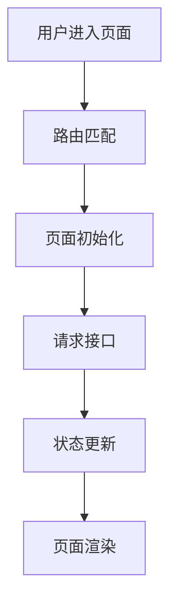

# Codebase Explorer Docs Skill

## Purpose

Use this skill when the user wants an agent to deeply explore an existing codebase and generate documentation that explains the project structure, technical architecture, business modules, data flow, code-reading path, and maintenance gotchas.

This skill is documentation-only.

It must not modify source files, add inline comments, refactor code, change business logic, rename anything, introduce dependencies, or reformat files.

## Core Goal

Help new developers quickly understand a repository by generating clear Markdown documentation based on code exploration.

The final output should explain:

1. What this project does.
2. How the repository is organized.
3. What the main business modules are.
4. How pages, routes, APIs, state, backend services, persistence, and data flow are connected.
5. How a new developer should read the code.
6. Where to start when modifying common requirements.
7. Which areas are risky, legacy, unclear, or require business confirmation.
8. Which business modules and gotchas are covered, partially covered, or not confirmed.

## Documentation Output Directory

Default output directory:

```text
docs/
```

If the user provides an explicit documentation output directory, write all generated Markdown documentation into that directory instead of the repository-local `docs/` directory.

Examples:

```text
docs/
../codebase-docs/repo-a/
/absolute/path/to/codebase-docs/repo-a/
```

When an external output directory is provided:

1. Treat the source repository as read-only.
2. Do not create or update `docs/` inside the source repository unless the user explicitly asks.
3. Write all final and intermediate Markdown files under the provided output directory.
4. Preserve evidence paths relative to the source repository where possible.

## Strict Write Boundary

Allowed to create or update only Markdown files under the selected documentation output directory.

Do not modify:

1. source files
2. configuration files
3. package files
4. lockfiles
5. build scripts
6. test files
7. generated files
8. vendor files
9. assets
10. formatting-only changes

If the output directory does not exist, create it.

If documentation already exists, update only the relevant Markdown files and preserve useful existing content.

## Non-Goals

Do not do the following unless the user explicitly asks:

1. Do not add comments to source code.
2. Do not refactor code.
3. Do not optimize code.
4. Do not fix bugs.
5. Do not rename files, functions, classes, variables, APIs, routes, state fields, DTOs, or database fields.
6. Do not introduce new dependencies.
7. Do not change lockfiles.
8. Do not reformat unrelated files.
9. Do not run migrations.
10. Do not invent business meaning when the code is unclear.

## Operating Principles

Follow these principles throughout the task:

1. Read before writing.
2. Treat the codebase as read-only.
3. Generate documentation from evidence found in the repository.
4. Separate confirmed facts from inferred conclusions.
5. Mark uncertain business meaning with `TODO: 需要业务确认`.
6. Prefer structured Markdown documentation over long, scattered notes.
7. Avoid vague summaries. Every module explanation should point to concrete paths and files.
8. Keep the final diff limited to the selected documentation output directory.
9. Do not over-document trivial files.
10. Focus on onboarding value for new developers.
11. Do not claim full coverage unless the coverage matrix supports that claim.

## Required Workflow

### Phase 1: Repository Exploration

Before reading source files one by one, run the deterministic inventory script:

```bash
./scripts/repo-inventory.sh \
  --root <source-repository> \
  --out <文档输出目录>/_analysis/repo-inventory.md
```

Read `_analysis/repo-inventory.md` once and use it as the exploration map.
Only deep-read high-signal files selected from the inventory and later evidence.
The script may run longer than 30 minutes; it has no model-budget timeout and
must not modify source files.

Identify:

1. Technology stack:
   - frontend framework
   - backend framework
   - build tools
   - routing solution
   - state management solution
   - API request layer
   - persistence layer
   - test tools
   - lint/typecheck tools

2. Repository structure:
   - top-level directories
   - important second-level directories
   - application entry files
   - route definitions
   - page/module locations
   - shared components
   - API/service layers
   - backend controllers/services/repositories, if any
   - configuration files

3. Runtime commands:
   - install command, if obvious
   - dev/start command
   - build command
   - test command
   - lint command
   - typecheck command

4. Core business modules:
   - module name
   - path
   - responsibility
   - key files
   - major dependencies
   - related APIs or backend services
   - business risk level

5. Data flow:
   - how user interactions enter the system
   - how routes map to pages or controllers
   - how APIs are called
   - how data is transformed
   - how state is stored or passed
   - how errors are handled
   - how authentication and authorization work

Do not modify any source file during Phase 1.

### Phase 2: Documentation Plan

After exploration, produce a documentation plan before writing files.

The plan must include:

1. Documentation files to create or update.
2. Purpose of each document.
3. Main sections of each document.
4. Key modules to analyze.
5. Unclear areas that require deeper reading.
6. Files/directories that must not be modified.
7. The selected documentation output directory.

The plan must explicitly confirm:

```text
Only Markdown documents under the selected documentation output directory will be created or updated.
No source files will be modified.
```

### Phase 3: Generate Documentation

Create the documentation output directory if it does not exist.

Generate or update the following files.

#### `project-overview.md`

Include:

1. Project introduction.
2. Technology stack.
3. Repository structure.
4. Entry files.
5. Local development commands.
6. Build/test/lint/typecheck commands, if available.
7. Main business modules.
8. Recommended reading order for new developers.
9. Common maintenance notes.

#### `module-analysis.md`

Include:

1. Core module list.
2. Business responsibility of each module.
3. Module entry files.
4. Important components/classes/functions.
5. Related APIs/services.
6. Data dependencies.
7. Typical business flows.
8. Maintenance risks.
9. Unclear business assumptions.
10. Business module coverage matrix.

Each module should follow this structure:

```markdown
## Module Name

- Path:
- Responsibility:
- Entry files:
- Key files:
- Related APIs/services:
- Data flow:
- Important business rules:
- Maintenance risks:
- Evidence:
- Coverage status:
- TODO: 需要业务确认:
```

#### `onboarding-guide.md`

This document must answer:

```text
How should a new developer get started with this project?
```

Include:

1. What to know before starting.
2. How to run the project.
3. Recommended reading order.
4. How to locate pages, routes, APIs, state, services, and business logic.
5. How to trace a feature from UI to API or from controller to persistence.
6. How to debug common problems.
7. Where to look first when modifying a requirement.
8. Suggested first-day checklist.
9. Suggested first-week checklist.

#### `api-and-data-flow.md`

Always generate this file. If the repository has no API calls, backend services,
state management, database access, or persistent data flow, explicitly state
`不适用`, the reasoning, and the evidence paths instead of omitting the file.

Include:

1. API request wrapper location.
2. Major API modules.
3. API call chain.
4. Frontend data flow, if applicable.
5. Backend controller-service-repository flow, if applicable.
6. State management structure.
7. Authentication, authorization, token, session, cache, or local storage logic.
8. Error handling and user-facing feedback logic.
9. Data transformation and DTO/model mapping.

#### `business-flow-summary.md`

Always generate this file for business-facing onboarding. If no business flow
can be confirmed, explicitly state `不适用`, the reasoning, the evidence paths,
and the questions that still require business confirmation.

Include:

1. Main business domains.
2. Important user journeys.
3. Business process diagrams in Mermaid, when helpful.
4. Key business states and status transitions.
5. External systems or upstream/downstream dependencies.
6. Risky or unclear business rules.
7. Product/operation terms found in the codebase.
8. Gotcha inventory.

Use Mermaid diagrams where they improve understanding.

Example:



## Required Onboarding Output

The documentation must explicitly answer:

> How should a new developer get started with this project?

Generate a dedicated section in `onboarding-guide.md` named:

```markdown
# 新同事上手指南
```

This section must include:

1. **上手前需要知道什么**
   - 项目主要解决什么业务问题
   - 当前工程属于前端、后端、全栈、BFF、微前端、组件库、CLI、服务端应用，还是混合工程
   - 新人需要提前了解的技术栈
   - 是否依赖特定运行环境、Node/Java 版本、包管理器、内网服务、代理、环境变量等

2. **如何把项目跑起来**
   - 安装依赖命令
   - 本地启动命令
   - 常见环境变量
   - 开发环境、测试环境、生产环境配置差异
   - 启动失败时优先检查哪些地方

3. **推荐阅读顺序**
   Must provide a concrete reading path.

4. **新人修改需求时应该从哪里开始**
   Cover common cases:
   - 新增页面
   - 修改已有页面
   - 新增接口调用
   - 修改后端接口
   - 修改状态管理逻辑
   - 修改登录/鉴权/权限逻辑
   - 修改表单/列表/详情页
   - 修改公共组件或工具函数
   - 排查接口异常
   - 排查页面跳转异常
   - 排查构建或启动异常

5. **新人调试路径**
   Explain:
   - 如何从页面定位到路由
   - 如何从路由定位到页面组件
   - 如何从页面组件定位到 API 请求
   - 如何从 API 请求定位到后端接口或 mock
   - 如何从状态字段定位到状态管理模块
   - 如何从错误提示定位到异常处理逻辑

6. **建议新人第一天 / 第一周阅读计划**

## Required Module Coverage Matrix

The documentation must explicitly answer:

> Are all business modules and important gotchas covered?

Generate a dedicated section in `module-analysis.md` named:

```markdown
## 业务模块覆盖矩阵
```

The matrix must include every business module discovered from the repository.

Discover modules from multiple evidence sources, including but not limited to:

1. route definitions
2. page directories
3. backend controllers
4. backend services
5. API modules
6. state management modules
7. menu configuration
8. permission configuration
9. domain/model/entity directories
10. feature directories
11. package/module naming
12. README or existing docs

For each module, include:

```markdown
| 模块 | 路径 | 入口文件 | 主要职责 | 相关 API/Service | 关键数据流 | Gotcha | 覆盖状态 | 证据来源 |
| ---- | ---- | -------- | -------- | ---------------- | ---------- | ------ | -------- | -------- |
```

The `覆盖状态` field must use one of:

1. `已覆盖`
2. `部分覆盖`
3. `未确认`
4. `未分析`
5. `疑似非业务模块`

Rules:

1. Do not claim full coverage unless the module has been traced through concrete files.
2. If a module is discovered but not deeply analyzed, mark it as `部分覆盖`.
3. If the business meaning is unclear, mark it as `未确认`.
4. If a directory looks like infrastructure or shared utility rather than business, mark it as `疑似非业务模块`.
5. Every module row must include concrete evidence paths.

## Required Gotcha Inventory

Generate a dedicated section in `business-flow-summary.md` or `module-analysis.md` named:

```markdown
## Gotcha 清单
```

A gotcha is any non-obvious behavior, hidden dependency, legacy constraint, environment requirement, fragile implementation, implicit business rule, or risky maintenance point.

The gotcha list must cover, when present:

1. 启动和构建 gotcha
2. 路由和页面 gotcha
3. 登录、鉴权和权限 gotcha
4. API 和数据 gotcha
5. 状态管理 gotcha
6. 业务规则 gotcha
7. 后端 gotcha

Each gotcha must use this format:

```markdown
## Gotcha: 简短标题

- 类型:
- 涉及模块:
- 涉及文件:
- 现象:
- 原因:
- 影响:
- 修改时注意:
- 证据来源:
- Confidence: high / medium / low
- TODO: 需要业务确认:
```

## Evidence and Uncertainty Handling

Documentation should distinguish between:

1. Confirmed from code.
2. Inferred from naming or call chain.
3. Unclear and requiring business confirmation.

Use labels where appropriate:

```markdown
- Confirmed:
- Inferred:
- TODO: 需要业务确认:
```

Do not invent business meaning.

If the code suggests multiple possible meanings, document the ambiguity instead of choosing one arbitrarily.

## Budget-Aware Execution Mode

Assume an operating budget of about 130k context tokens and about 200 model
requests per 30 minutes. These are operator/runtime limits, not values the Agent
can measure precisely. One assistant turn is approximately one model request;
multiple independent tool calls issued in the same turn do not add model
requests, so batch independent reads and searches when the tool environment
supports parallel calls.

The Shell inventory can run for a long time. The Agent boundary is different:
one invocation/session may deeply explore only one repository. Even if the
current repository finishes early, do not begin a second repository in the same
session.

All five final documents are mandatory:

```text
project-overview.md
module-analysis.md
onboarding-guide.md
api-and-data-flow.md
business-flow-summary.md
```

Budget pressure may leave drafts incomplete, but it never reduces the completion
contract to three documents.

### Intermediate Analysis Files

To avoid losing context, create intermediate analysis notes under:

```text
_analysis/
```

Allowed intermediate files:

```text
_analysis/repo-inventory.md
_analysis/module-discovery.md
_analysis/route-map.md
_analysis/api-map.md
_analysis/state-map.md
_analysis/gotcha-candidates.md
_analysis/coverage-checklist.md
```

These files should record evidence, paths, and unresolved questions.

### Incremental Workflow

1. Safety boundary check.
2. Run `repo-inventory.sh` and read the compact inventory.
3. Build a high-signal queue in this priority order: entry files, routes,
   manifests/configuration, API/service, top-level business modules.
4. Read no more than 5 to 10 independent or closely related files per round;
   issue independent reads/searches in parallel within one assistant turn.
5. After every stable evidence group, immediately update `_analysis` notes and
   `_analysis/coverage-checklist.md`.
6. Assemble or update all five documents.
7. Run the coverage self-check and completion validator.

`_analysis/coverage-checklist.md` is the resume anchor. It must contain:

```text
Completion: incomplete

## 已分析模块
## 进行中模块
## 部分覆盖、未确认和未分析模块
## 下一批 high-signal 文件
## 待业务确认
## 五份文档状态
```

For `进行中模块`, record the current module, files already read, unresolved
questions, and the next files to inspect. Shell cannot snapshot model reasoning
and does not automatically wake or restore an Agent. A later operator/runtime
invocation resumes by reading this checklist and continuing the in-progress
module.

### Context Checkpoint

Context pressure is the highest-priority observable stop signal. When the
platform reports context pressure or compaction, or continued reading would
crowd out document generation:

1. Stop expanding exploration.
2. Update the checklist, especially `进行中模块` and the next-file queue.
3. Write confirmed conclusions and coverage status into the existing documents.
4. Keep `Completion: incomplete`.
5. End the current single-repository session.

Never fabricate missing conclusions to reach `complete`. The next session should
resume the unfinished repository before selecting a new one.

## Required Coverage Self-Check

Generate a section named:

```markdown
## 覆盖度自检
```

Include:

```markdown
| 检查项                     | 结果       | 说明 |
| -------------------------- | ---------- | ---- |
| 路由模块是否覆盖           | 是/部分/否 |      |
| 页面模块是否覆盖           | 是/部分/否 |      |
| API/service 是否覆盖       | 是/部分/否 |      |
| 登录/鉴权/权限是否覆盖     | 是/部分/否 |      |
| 状态管理是否覆盖           | 是/部分/否 |      |
| 错误处理是否覆盖           | 是/部分/否 |      |
| 构建/启动 gotcha 是否覆盖  | 是/部分/否 |      |
| 核心业务流程是否覆盖       | 是/部分/否 |      |
| 未确认模块是否列出         | 是/否      |      |
| 需要业务确认的问题是否列出 | 是/否      |      |
```

Important:

Do not write “all modules are covered” unless the coverage matrix supports that claim.

If coverage is incomplete, explicitly list:

1. modules not analyzed
2. files not inspected
3. business flows not confirmed
4. questions requiring human confirmation

## Completion Contract

Completion requires all five documents, every template H1/H2 section with
non-empty content, a populated coverage matrix, completed coverage self-check,
the inventory module-count proxy, evidence paths, and:

```text
Completion: complete
```

in `_analysis/coverage-checklist.md`.

Use one completion path:

1. Finish the five documents and perform the semantic self-check.
2. Change the checklist declaration to `Completion: complete`.
3. Run:

```bash
./scripts/validate-doc-completion.sh --docs-root <文档输出目录>
```

4. If validation fails, restore `Completion: incomplete`, fix the reported
   structural gaps, and retry.

The validator only checks mechanically observable structure. Evidence truth and
whether an `不适用` conclusion is credible remain the Agent's responsibility.
Template H1/H2 headings, the coverage-matrix and self-check section titles,
their column names, and the template self-check item labels are all validation
contract. Changing any of them is a breaking change for previously generated
documents.

## Lightweight Verification and Diff Review

This task is documentation-only. Full build/test is not required.

Perform lightweight verification:

1. Run `git status`.
2. Confirm that no source files were modified.
3. Run `validate-doc-completion.sh` before declaring completion.
4. If the selected documentation output directory is inside the source repo, run `git diff -- <doc-output-dir>`.
5. If the selected documentation output directory is outside the source repo, verify the files exist there and run `git status` in the source repo.

Both inventory generation and documentation generation must leave source files
unchanged.

Do not run expensive commands by default.

Do not run:

1. full production build
2. full test suite
3. integration tests
4. e2e tests
5. commands requiring external services
6. database migrations

Optional checks:

If the repository has a documentation lint command and it is fast, it may be run.

Examples:

```bash
npm run lint:docs
pnpm lint:docs
yarn lint:docs
```

If no documentation validation command exists, simply state that no doc-specific validation command was found.

## Final Delivery Summary

At the end, provide a final summary with:

1. Documentation files added.
2. Documentation files updated.
3. Documentation output directory.
4. Purpose of each document.
5. Main modules analyzed.
6. Important business flows documented.
7. Areas that still require business confirmation.
8. Verification commands executed.
9. Confirmation that no source files were modified.
10. Suggested next review steps for the human maintainer.

## Acceptance Criteria

The final result must satisfy:

1. Only Markdown files under the selected documentation output directory are created or updated.
2. No source files are modified.
3. No dependencies are added.
4. No lockfiles are changed.
5. No business logic is changed.
6. Documentation explains:
   - project purpose
   - technology stack
   - repository structure
   - main modules
   - API/data flow
   - business flow
   - code-reading path
   - onboarding path
7. Unclear business assumptions are marked with `TODO: 需要业务确认`.
8. All five template documents exist; `不适用` sections include reasoning and evidence.
9. `validate-doc-completion.sh` succeeds.
10. Final result is documentation-only and easy to review.

## Suggested First Response When Activated

When this skill is activated, start with:

“I will inspect the repository in read-only mode first. I will only create or update Markdown files under the selected documentation output directory, and I will not modify source files.”

Then begin Phase 1.
