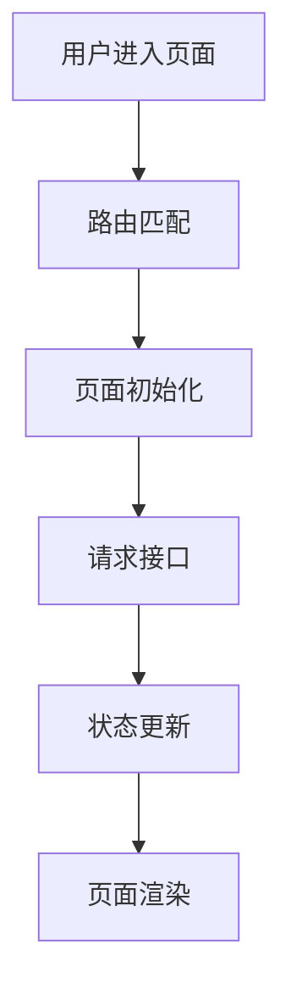

# Single-Repo Workflow and Document Specification

This reference drives **single mode** and defines what goes inside each generated
document. `SKILL.md` keeps the high-level workflow, budget, and completion
contract; the operational detail and per-document content live here so the
always-loaded skill body stays lean.

The section headings called out below are validation contract:
`validate-doc-completion.sh` checks them mechanically against
`templates/documents/`. Keep the exact H1/H2 wording. Everything else is guidance
you should adapt to the repository in front of you — the goal is onboarding
value, not filling a form.

## Table of Contents

1. [Workflow](#workflow)
2. [project-overview.md](#project-overviewmd)
3. [module-analysis.md](#module-analysismd)
4. [onboarding-guide.md](#onboarding-guidemd)
5. [api-and-data-flow.md](#api-and-data-flowmd)
6. [business-flow-summary.md](#business-flow-summarymd)
7. [architecture.md](#architecturemd)
8. [Required Onboarding Output](#required-onboarding-output)
9. [Required Module Coverage Matrix](#required-module-coverage-matrix)
10. [Required Gotcha Inventory](#required-gotcha-inventory)
11. [Required Coverage Self-Check](#required-coverage-self-check)
12. [Intermediate Analysis Files](#intermediate-analysis-files)

---

## Workflow

### Phase 1: Exploration

Before reading source files one by one, run the deterministic inventory script:

```bash
./scripts/repo-inventory.sh \
  --root <source-repository> \
  --out <文档输出目录>/_analysis/repo-inventory.md
```

Read `_analysis/repo-inventory.md` once and use it as the exploration map. Only
deep-read high-signal files selected from the inventory and later evidence. The
script may run longer than 30 minutes; it has no model-budget timeout and must
not modify source files. From the inventory, identify the technology stack,
repository structure, runtime commands, core business modules, and data flow.

### Phase 2: Plan

Produce a short documentation plan: which files to create/update, the key modules
to analyze, the unclear areas needing deeper reading, and an explicit confirmation
that only Markdown under the output directory will change and no source files will
be modified.

### Phase 3: Generate

Create the output directory if needed, then generate or update every document
listed below. Build a high-signal queue in priority order (entry files, routes,
manifests/config, API/service, top-level business modules), read no more than
5–10 related files per round (in parallel within one turn), and after every
stable evidence group update the `_analysis` notes and
`_analysis/coverage-checklist.md`. Distinguish confirmed facts from inferences;
mark unclear business meaning with `TODO: 需要业务确认`.

## project-overview.md

The map a new developer reads first. Cover:

1. Project introduction — what it does, who it serves.
2. Technology stack.
3. Repository structure.
4. Entry files.
5. Local development commands.
6. Build/test/lint/typecheck commands, if available.
7. Main business modules.
8. Recommended reading order for new developers.
9. Common maintenance notes.

## module-analysis.md

The per-module breakdown plus the coverage matrix. Cover:

1. Core module list.
2. Business responsibility of each module.
3. Module entry files.
4. Important components/classes/functions.
5. Related APIs/services.
6. Data dependencies.
7. Typical business flows.
8. Maintenance risks.
9. Unclear business assumptions.
10. Business module coverage matrix (see
    [Required Module Coverage Matrix](#required-module-coverage-matrix)).

Each module should follow this structure:

```markdown
## Module Name

- Path:
- Responsibility:
- Entry files:
- Key files:
- Related APIs/services:
- Data flow:
- Important business rules:
- Maintenance risks:
- Evidence:
- Coverage status:
- TODO: 需要业务确认:
```

## onboarding-guide.md

Answers one question: _how should a new developer get started with this
project?_ Cover:

1. What to know before starting.
2. How to run the project.
3. Recommended reading order.
4. How to locate pages, routes, APIs, state, services, and business logic.
5. How to trace a feature from UI to API or from controller to persistence.
6. How to debug common problems.
7. Where to look first when modifying a requirement.
8. Suggested first-day checklist.
9. Suggested first-week checklist.

The detailed `# 新同事上手指南` section contract is in
[Required Onboarding Output](#required-onboarding-output).

## api-and-data-flow.md

Always generate this file. If the repository has no API calls, backend services,
state management, database access, or persistent data flow, state `不适用`, the
reasoning, and the evidence paths — a missing file is not a valid way to say
"not applicable", because reviewers can't tell "absent because irrelevant" from
"absent because skipped". Cover:

1. API request wrapper location.
2. Major API modules.
3. API call chain.
4. Frontend data flow, if applicable.
5. Backend controller-service-repository flow, if applicable.
6. State management structure.
7. Authentication, authorization, token, session, cache, or local storage logic.
8. Error handling and user-facing feedback logic.
9. Data transformation and DTO/model mapping.

## business-flow-summary.md

Always generate this file for business-facing onboarding. If no business flow
can be confirmed, state `不适用`, the reasoning, the evidence paths, and the
questions that still need business confirmation. Cover:

1. Main business domains.
2. Important user journeys.
3. Business process diagrams in Mermaid, when they improve understanding.
4. Key business states and status transitions.
5. External systems or upstream/downstream dependencies.
6. Risky or unclear business rules.
7. Product/operation terms found in the codebase.
8. Gotcha inventory (see [Required Gotcha Inventory](#required-gotcha-inventory)).

Example diagram:



## architecture.md

Turns the exploration evidence into runtime architecture and call/dependency
views (step 5 of the loop). Two Mermaid diagrams are mandatory, and each must
declare its source with a `%% Evidence: <path>` comment line inside the diagram —
that comment is what keeps the diagram honest and lets a reviewer verify a node
or edge against real code:

1. `## 运行时架构总览` — one `flowchart LR` runtime architecture diagram
   (client/entry → routing → modules/services → state → persistence/external).
2. `## 模块调用与依赖关系` — one Mermaid module call/dependency graph derived
   from real imports and call sites, not guessed.

Also include:

3. `## 关键调用链路` — 1 to 3 core call chains traced from entry to data.
4. `## 架构风险与边界` — coupling, cross-cutting concerns, external boundaries.
5. `## TODO: 需要业务确认` — anything inferred but not yet confirmed.

Do not invent nodes or edges; every node and edge must trace to an evidence
path. `validate-doc-completion.sh` requires at least two Mermaid code blocks and
at least two `%% Evidence:` declarations in this file.

---

## Required Onboarding Output

`onboarding-guide.md` must contain a section named exactly:

```markdown
# 新同事上手指南
```

It must include:

1. **上手前需要知道什么**
   - 项目主要解决什么业务问题
   - 当前工程属于前端、后端、全栈、BFF、微前端、组件库、CLI、服务端应用，还是混合工程
   - 新人需要提前了解的技术栈
   - 是否依赖特定运行环境、Node/Java 版本、包管理器、内网服务、代理、环境变量等

2. **如何把项目跑起来**
   - 安装依赖命令
   - 本地启动命令
   - 常见环境变量
   - 开发环境、测试环境、生产环境配置差异
   - 启动失败时优先检查哪些地方

3. **推荐阅读顺序** — a concrete reading path, not a vague suggestion.

4. **新人修改需求时应该从哪里开始** — cover the common cases:
   - 新增页面 / 修改已有页面
   - 新增接口调用 / 修改后端接口
   - 修改状态管理逻辑
   - 修改登录/鉴权/权限逻辑
   - 修改表单/列表/详情页
   - 修改公共组件或工具函数
   - 排查接口异常 / 排查页面跳转异常 / 排查构建或启动异常

5. **新人调试路径** — explain how to trace:
   - 页面 → 路由 → 页面组件 → API 请求 → 后端接口或 mock
   - 状态字段 → 状态管理模块
   - 错误提示 → 异常处理逻辑

6. **建议新人第一天 / 第一周阅读计划**

## Required Module Coverage Matrix

`module-analysis.md` must contain a section named exactly:

```markdown
## 业务模块覆盖矩阵
```

The matrix must include every business module discovered from the repository.
Discover modules from multiple evidence sources — route definitions, page
directories, backend controllers/services, API modules, state modules, menu and
permission config, domain/model/entity directories, feature directories,
package/module naming, and existing README/docs.

Each row uses these columns:

```markdown
| 模块 | 路径 | 入口文件 | 主要职责 | 相关 API/Service | 关键数据流 | Gotcha | 覆盖状态 | 证据来源 |
| ---- | ---- | -------- | -------- | ---------------- | ---------- | ------ | -------- | -------- |
```

`覆盖状态` must be one of: `已覆盖`, `部分覆盖`, `未确认`, `未分析`,
`疑似非业务模块`.

The point of the matrix is to make coverage honest and auditable, so:

1. Don't claim `已覆盖` unless the module was traced through concrete files.
2. A discovered-but-not-deeply-analyzed module is `部分覆盖`.
3. Unclear business meaning is `未确认`.
4. Infrastructure/shared-utility directories that aren't business are
   `疑似非业务模块`.
5. Every row needs concrete evidence paths.

## Required Gotcha Inventory

`business-flow-summary.md` or `module-analysis.md` must contain a section named
exactly:

```markdown
## Gotcha 清单
```

A gotcha is any non-obvious behavior, hidden dependency, legacy constraint,
environment requirement, fragile implementation, implicit business rule, or
risky maintenance point — the things that bite a new developer because they
aren't visible in the obvious place. Cover, when present: 启动和构建、路由和页面、
登录/鉴权/权限、API 和数据、状态管理、业务规则、后端。

Each gotcha uses this format:

```markdown
## Gotcha: 简短标题

- 类型:
- 涉及模块:
- 涉及文件:
- 现象:
- 原因:
- 影响:
- 修改时注意:
- 证据来源:
- Confidence: high / medium / low
- TODO: 需要业务确认:
```

## Required Coverage Self-Check

`module-analysis.md` must contain a section named exactly `## 覆盖度自检` with this
table. Do not claim full coverage unless the coverage matrix supports it; if
coverage is incomplete, list the unanalyzed modules, uninspected files,
unconfirmed flows, and open questions.

```markdown
| 检查项                     | 结果       | 说明 |
| -------------------------- | ---------- | ---- |
| 路由模块是否覆盖           | 是/部分/否 |      |
| 页面模块是否覆盖           | 是/部分/否 |      |
| API/service 是否覆盖       | 是/部分/否 |      |
| 登录/鉴权/权限是否覆盖     | 是/部分/否 |      |
| 状态管理是否覆盖           | 是/部分/否 |      |
| 错误处理是否覆盖           | 是/部分/否 |      |
| 构建/启动 gotcha 是否覆盖  | 是/部分/否 |      |
| 核心业务流程是否覆盖       | 是/部分/否 |      |
| 未确认模块是否列出         | 是/否      |      |
| 需要业务确认的问题是否列出 | 是/否      |      |
```

## Intermediate Analysis Files

To avoid losing context, record evidence, paths, and unresolved questions under
`_analysis/` (e.g. `module-discovery.md`, `route-map.md`, `api-map.md`,
`state-map.md`, `gotcha-candidates.md`). `_analysis/coverage-checklist.md` is the
resume anchor and must keep its template sections (`Completion: incomplete` until
done, `## 已分析模块`, `## 进行中模块`, `## 部分覆盖、未确认和未分析模块`,
`## 下一批 high-signal 文件`, `## 待业务确认`, `## 文档状态`). For `进行中模块`,
record the current module, files already read, unresolved questions, and the next
files to inspect — a later session resumes from here.
