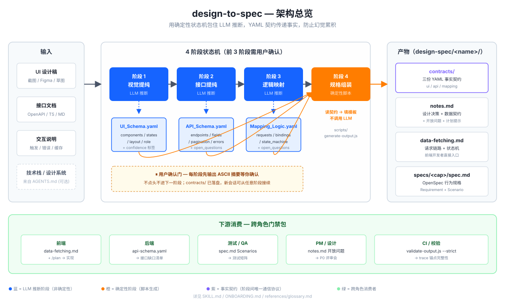

# design-to-spec — 使用指南

> 将 UI 设计稿和接口文档转换成结构化规格包，让后续 AI 或开发者稳定实现。

**当前版本**：`0.10.1`



> **第一次来？** 先读 [ONBOARDING.md](ONBOARDING.md)（3 分钟决定要不要用 + 接入到项目 + 第一次跑通）。
> **想直接看一份真实对话长什么样？** 读 [examples/transcript-search-panel.md](examples/transcript-search-panel.md)（用户视角的完整 4 阶段对话回放）。
> **要把 skill 接进 Claude Code / OpenCode / Cursor 等？** 读 [references/install-by-harness.md](references/install-by-harness.md)（兼容性矩阵 + 每种 harness 的安装命令和冒烟测试）。
> **要拿真实设计稿动手？** 读 [references/operator-guide.md](references/operator-guide.md)（零基础操作手册，含多视觉稿、context 受限、跨组件复用等实战策略）。
> **跑不通 / 看到生词？** 直接查 [references/troubleshooting.md](references/troubleshooting.md)（按症状 grep）和 [references/glossary.md](references/glossary.md)（术语速查）。
> **要把 skill 接入项目级配置？** 复制 [templates/agents-snippet.md](templates/agents-snippet.md) 或 [templates/claude-md-snippet.md](templates/claude-md-snippet.md) 到项目根。
> **要把校验跑进 CI / pre-commit？** 读 [references/ci-integration.md](references/ci-integration.md)，模板在 [templates/ci/](templates/ci/)。
> **要给 PM / QA / 后端讲怎么 review？** 读 [references/reviewer-guide.md](references/reviewer-guide.md)（四视角签收 checklist）。
> **想看真实需求"用 vs 不用"工作量差多少？** 读 [references/case-study-feedback-form.md](references/case-study-feedback-form.md)。
> 本 README 偏参考手册，原理与校验规则为主。

`design-to-spec` 采用四阶段状态机：视觉提纯、接口提纯、逻辑映射、规格组装。前三阶段分别生成 YAML 契约，第四阶段只读取契约机械填充模板，不重新看图或重新推断接口。

```
WAITING_FOR_UI -> WAITING_FOR_API -> WAITING_FOR_MAPPING -> GENERATING_SPEC
       |                 |                   |                    |
 UI_Schema.yaml    API_Schema.yaml   Mapping_Logic.yaml    notes/data-fetching/spec
```

## 何时使用

适合：

- 你有 UI 截图、mockup、wireframe 或设计稿，想把它变成实现规格
- 你希望把视觉元素、接口字段、状态机和 OpenSpec Scenario 对齐
- 你需要产出 `notes.md`、`data-fetching.md`、`spec.md` 给后续 `/plan`、实现或评审使用

不适合：

- 纯美学反馈，例如“好不好看”
- 像素级 CSS 抄写
- 没有实现意图的浏览性讨论

## 输入

| 输入          | 必需 | 说明                                                                 |
| ------------- | ---- | -------------------------------------------------------------------- |
| UI 设计稿     | 是   | 截图、SVG、Figma 导出图，或清晰的组件树描述                          |
| 组件名称      | 推荐 | 缺失时从设计稿或语义推断                                             |
| 接口文档      | 推荐 | OpenAPI、Swagger、Markdown、TypeScript 类型、Postman Collection 均可 |
| 交互/数据说明 | 推荐 | 触发时机、失败处理、分页、缓存、轮询、父组件传参等                   |
| 目标技术栈    | 可选 | `web`、`miniprogram` 等；用于加载对应 stack hints                    |

没有接口文档时，`API_Schema.endpoints` 为空，数据字段会降级为推断，并在开放问题中要求确认。

## 输出

```
<workspace>/design-spec/<component-name>/
├── contracts/
│   ├── ui-schema.yaml
│   ├── api-schema.yaml
│   └── mapping-logic.yaml
├── notes.md
├── data-fetching.md
└── specs/<capability>/spec.md
```

- `contracts/`：三阶段 YAML 事实契约，供续跑、校验、规划和实现复查
- `notes.md`：设计决策、数据契约、状态枚举、组件分解、开放问题、埋点锚点
- `data-fetching.md`：请求链路、触发条件、分页缓存、错误分级、竞态处理、请求状态机
- `spec.md`：OpenSpec 行为规格，包含 `Requirement` 和可测试的 `Scenario`

生成器会写入机器可校验的 trace 锚点：`component:<id>`、`binding:<index>:<direction>`、`state:<id>`、`request:<id>`。`validate-output.js --strict` 会在存在 `## Traceability` 时校验这些锚点，防止 markdown 润色时丢掉契约引用。

## 运行流程

### 1. 视觉提纯

读取设计稿，输出 `UI_Schema`：

- 枚举所有可见元素，保留逐字文本、省略号、数值和单位
- 用 `parent_id` 表达层级，用 `repeat_source` 表达列表重复结构
- 用 `semantic_type` 保留复杂控件的真实语义；局部状态用 `scope` / `scope_components` 绑定作用范围
- 标记每个元素的 `confidence`：`identified`、`inferred`、`needs_human_input`
- 补全 `loading`、`empty`、`success`、`error` 四个基础状态
- 为每个状态写 `render_assertion`，供 `spec.md` 机械生成 `THEN`

用户确认摘要必须比纯列表更直观：基于 `components[].parent_id` 生成单一 ASCII 图表，其中 `*` 表示可交互组件，`?` 表示 `needs_human_input`。图表只从阶段一 YAML 生成，用于确认层级和风险点，不作为新的事实源。

### 2. 接口提纯

读取接口文档，输出 `API_Schema`：

- 只保留组件实际消费的接口、参数和响应字段
- Header、鉴权等通用字段默认过滤
- 请求体、错误结构、分页游标、排序、筛选、缓存 key 如果影响 UI 或请求状态，必须保留
- `auth_required`、`pagination`、`error_shape`、`cache_key_fields` 用于把登录态、分页、错误兜底和缓存命中规则传给实现者
- 枚举值必须完整列出；不确定时写 `enums: [UNKNOWN]` 并加入 `api.open_questions`

### 3. 逻辑映射

结合 `UI_Schema` 和 `API_Schema`，输出 `Mapping_Logic`：

- `data_fetching.requests[]` 记录一个或多个请求，包括触发时机、endpoint、call type、依赖关系
- `cache_policy`、`retry_policy`、`concurrency_policy` 记录缓存、重试、abort、去重和过期响应处理
- `bindings[]` 记录 UI 到 API 参数、API 响应到 UI 元素的绑定
- `state_machine[]` 记录状态转换，每条转换包含 `event` 和 `render_assertion`
- 不确定项进入 `mapping.open_questions`，不静默猜测

### 4. 规格组装

读取三份 YAML 契约，生成三份文件：

- `notes.md` 从契约生成设计笔记和数据契约
- `data-fetching.md` 从请求清单和状态机生成数据获取设计
- `spec.md` 从 `state_machine.event` 和 `render_assertion` 生成 Scenario

第四阶段默认先运行 `scripts/generate-output.js` 生成基线文件，再做有限人工化修订。修订不得重新分析图片或接口文档；如果缺少可断言结果，生成 `needs_human_input` 占位 Scenario，并把问题加入开放问题。

## 关键规则

- 阶段顺序不可跳过，前三阶段都需要用户确认后再进入下一阶段
- YAML 契约是阶段间唯一事实源，输出文件不得绕过契约重新推断
- `required: true` 的状态必须在 `spec.md` 中至少有一条 Scenario
- `Requirement`、`Scenario`、`WHEN`、`THEN` 保持英文关键字，兼容 OpenSpec 验证器
- 改造既有组件时使用 `templates/spec-modified.md`，`MODIFIED Requirements` 下的 Requirement 标题必须与既有 spec 逐字一致

## 质量检查

阶段四前可运行契约校验脚本。脚本会先读取 `design-to-spec/schemas/*.json` 做结构校验，再检查三份契约之间的引用关系：

```bash
node design-to-spec/scripts/validate-contracts.js \
  --ui design-spec/<component>/contracts/ui-schema.yaml \
  --api design-spec/<component>/contracts/api-schema.yaml \
  --mapping design-spec/<component>/contracts/mapping-logic.yaml
```

环境要求：Node.js ≥ 18。在 `design-to-spec/` 下首次执行前运行 `npm install` 安装唯一的运行时依赖 `js-yaml`。JSON Schema 校验由脚本内置的 Draft 7 子集校验器完成，不需要其他第三方依赖。

校验内容包括：

- 契约是否符合对应 JSON Schema
- YAML 是否可解析
- `mapping.component` 是否等于 `ui.name`
- `components[].id`、`states[].id`、`api.endpoints[].id`、`requests[].id` 等关键锚点是否唯一
- `requests[].endpoint` 是否存在于 `api.endpoints`
- `bindings` 是否引用了存在的 UI component、API param 或 response field
- `state_machine.to` 是否指向存在的 UI state
- `required: true` 状态是否具备 `render_assertion`

契约校验通过后，可用确定性生成脚本创建输出目录和基线文件：

```bash
node design-to-spec/scripts/generate-output.js \
  --ui design-spec/<component>/contracts/ui-schema.yaml \
  --api design-spec/<component>/contracts/api-schema.yaml \
  --mapping design-spec/<component>/contracts/mapping-logic.yaml \
  --out-dir design-spec/<component>
```

生成脚本会保留三份契约到 `contracts/`，并写入 `notes.md`、`data-fetching.md`、`specs/<capability>/spec.md`。如果后续手动或由 LLM 修订 markdown，仍需把 `contracts/` 当作唯一事实源。

阶段四后可运行输出校验脚本：

```bash
node design-to-spec/scripts/validate-output.js \
  --ui design-spec/<component>/contracts/ui-schema.yaml \
  --api design-spec/<component>/contracts/api-schema.yaml \
  --mapping design-spec/<component>/contracts/mapping-logic.yaml \
  --notes design-spec/<component>/notes.md \
  --data-fetching design-spec/<component>/data-fetching.md \
  --spec design-spec/<component>/specs/<capability>/spec.md
```

输出校验会检查 OpenSpec 关键字、`required: true` 状态覆盖、请求 endpoint 是否进入 `data-fetching.md`、`ui_to_event` 事件是否进入 `notes.md` 或 `spec.md`，以及开放问题和待确认章节是否存在。脚本优先解析结构化锚点：`notes.md` 的「状态枚举」表、「开放问题」编号列表和「埋点锚点」表；只有缺少结构化锚点时才退回弱文本匹配。开放问题改写导致的弱匹配默认输出 warning；加 `--strict` 可把 warning 作为错误处理。

当 `notes.md` 包含 `## Traceability` 时，输出校验还会检查：

- 每个 UI component 有 `component:<id>` trace
- 每个 binding 有 `binding:<index>:<direction>` trace
- 每个 request 在 `data-fetching.md` 有 `request:<id>` trace
- 每个 required state 在 `spec.md` 有 `state:<id>` trace

## 下游使用

推荐把整个输出目录交给规划或实现流程，而不是只传单个文件：

```bash
/plan --target <stack> ./design-spec/<component-name>/
```

`notes.md` 提供设计和数据上下文，`data-fetching.md` 提供请求实现细节，`spec.md` 提供可测试验收标准。后续 skill 不应重新阅读原始设计稿，而应消费这三份文件作为单一事实源。

## 回归测试

生成链路可用 golden sample 验证。在 `design-to-spec/` 目录下：

```bash
npm test
```

会一次跑完 `scripts/tests/*.test.js`：覆盖生成结果、trace 锚点、扩展契约和包裹完整性 4 个回归套件，从 `examples/today-windvane/contracts/*.yaml` 和扩展契约样例生成临时输出，并用 `validate-output.js --strict` 校验结果。

环境冒烟：

```bash
npm run smoke
```

跑一遍最常用路径（用 `today-windvane` 金样跑 validate-contracts → generate-output → validate-output --strict），1 秒内输出 ✅/❌。装好后用这条命令验证环境，比 `npm test` 更快、信号更明确。

## 升级前必读

`design-to-spec` 遵循 [语义化版本](https://semver.org/lang/zh-CN/)：

- **major（X.0.0）**：YAML 契约 schema 不向后兼容、CLI 标志或退出码改变、产出文件结构改变。升级前必读 CHANGELOG `## Migration` 段。
- **minor（0.X.0）**：新增字段 / 新增可选 CLI 标志 / 新文档资源；现有契约不动即可继续工作。
- **patch（0.0.X）**：bug 修复、文档补强、模板措辞调整、新增 reference / template 文件。

每次升级建议按下面三步走：

1. **读 CHANGELOG `## [新版本]` 的 `### Breaking`、`### Migration`、`### Removed` 子段**——三段都是空也要确认（能 grep `### Breaking` 看到字面"无"）；以下 4 张表凡是出现的项必须当成 P0 处理：CLI 标志删除 / schema 必填字段新增 / 输出目录结构变化 / 校验脚本默认行为变化。
2. **重跑 `npm install` + `npm run smoke`**：验证依赖和环境。失败先看 [troubleshooting.md](./references/troubleshooting.md) §安装环境，再开 issue。
3. **重跑你已有的 `design-spec/<component>/` 校验**：

   ```bash
   for d in design-spec/*/; do
     node design-to-spec/scripts/validate-contracts.js \
       --ui $d/contracts/ui-schema.yaml \
       --api $d/contracts/api-schema.yaml \
       --mapping $d/contracts/mapping-logic.yaml || echo "FAIL: $d"
   done
   ```

   有 contracts 校验失败的目录 → 按 CHANGELOG 的 `### Migration` 改 yaml；有 markdown `--strict` 失败 → 重跑 `generate-output.js` 让产物对齐新 schema（永远不要手改 markdown 绕过）。

`### Breaking` / `### Migration` 子段约定见 [CHANGELOG.md](./CHANGELOG.md) 顶部说明。每个版本即使没有破坏性变更，作者也会显式写「无」，保证读者只看一处就能判断是否安全升级。
