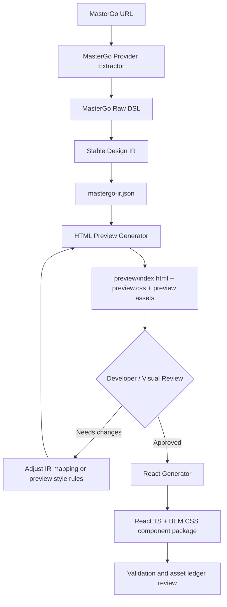

# mastergo-to-component Architecture Design

## Goal

Create a skill that converts a MasterGo design URL into frontend code through a two-stage workflow:

1. Fetch and normalize MasterGo DSL into a stable intermediate representation.
2. Generate a static HTML preview for developer and visual review.
3. After explicit approval, generate a React + TypeScript + BEM CSS component package.

The first reference design is:

```text
https://mastergo.com/file/192813714739577?fileOpenFrom=home&page_id=M&devMode=true&layer_id=2%3A0031
```

The first generated target is React + TypeScript + BEM CSS. CSS must be split by component in the final React output.

This skill is the first concrete provider in the broader design-source pipeline described in [`../../../docs/design-source-to-component-architecture.md`](../../../docs/design-source-to-component-architecture.md). It should not be treated as an isolated one-off generator: MasterGo-specific extraction feeds a provider-neutral Stable Design IR, and later Figma or Sketch providers should be able to reuse the same preview and React generation contract.

## Non-Goals For The Initial Scaffold

- Do not implement DSL fetching yet.
- Do not implement HTML preview generation yet.
- Do not implement React generation yet.
- Do not create an active `SKILL.md` until the architecture and execution details are approved.
- Do not call the MasterGo API from this scaffold step.

## Overall Architecture



## Relationship To `image-to-component`

`image-to-component` starts from screenshots and should remain a structure-first skeleton workflow. It can infer component trees, state differences, props, and asset ledgers, but it must not promise design-source-level styling.

`mastergo-to-component` starts from structured MasterGo DSL. It can use real design source signals such as node names, text nodes, layout values, style fields, component instances, and asset references. That is why it owns the high-fidelity route: Stable Design IR -> HTML preview -> approved React package.

## Proposed Skill Directory

```text
skills/mastergo-to-component/
├── docs/
│   └── architecture-design.md
├── agents/
├── references/
├── scripts/
│   ├── src/
│   └── tests/
│       └── fixtures/
└── examples/
```

`SKILL.md` is intentionally omitted in this first scaffold so the incomplete skill is not discoverable as a ready-to-use workflow.

## Runtime Architecture

When implemented, the scripts package should contain these modules:

```text
scripts/src/
├── cli.ts
├── parse-url.ts
├── fetch-dsl.ts
├── normalize-dsl.ts
├── generate-preview.ts
├── generate-react.ts
├── write-files.ts
└── types.ts
```

### Module Responsibilities

| Module | Responsibility |
|---|---|
| `parse-url.ts` | Parse MasterGo file URLs and `/goto/` URLs. Extract `fileId` and `layerId`. |
| `fetch-dsl.ts` | Implement the MasterGo provider extractor: read `MASTERGO_TOKEN` safely and request MasterGo DSL from `/mcp/dsl`. |
| `normalize-dsl.ts` | Convert raw MasterGo DSL into provider-neutral Stable Design IR, saved as `mastergo-ir.json`. |
| `generate-preview.ts` | Generate reviewable static HTML, CSS, and preview asset placeholders from IR. |
| `generate-react.ts` | Generate React + TypeScript + BEM CSS component package from approved IR. |
| `write-files.ts` | Write generated files, ensure directories, and prevent accidental overwrite when requested. |
| `types.ts` | Define raw DSL adapter types, normalized IR types, and output file descriptors. |
| `cli.ts` | Provide command entrypoints such as `preview` and `generate-react`. |

## Why Convert Raw MasterGo DSL Into Stable Design IR

MasterGo DSL is design-tool data. It contains low-level design concepts such as `FRAME`, `INSTANCE`, `GROUP`, `LAYER`, `PATH`, `SVG_ELLIPSE`, `TEXT`, `layout`, `style`, and `children`.

Frontend generation needs a more stable contract:

- Which parts are semantic components.
- Which text nodes are business data.
- Which layers are visual decoration.
- Which images or icons need assets.
- Which CSS block names should be generated.
- Which parts cannot be reliably automated and need a ledger entry.

The IR is that contract. It translates noisy design-tool structure into a predictable JSON shape used by both output stages:

```text
MasterGo raw DSL
-> mastergo-ir.json
-> HTML preview
-> React component package
```

This prevents the preview generator and React generator from each inventing their own interpretation of the raw MasterGo tree.

The same IR boundary is also what keeps the architecture ready for future providers:

```text
MasterGo DSL   \
Figma data      -> Stable Design IR -> Preview -> React
Sketch IR      /
```

### Example Raw DSL Shape

The raw DSL might represent a hotel card as unnamed frames and text nodes:

```json
{
  "type": "FRAME",
  "name": "编组 6备份 6",
  "children": [
    { "type": "TEXT", "characters": "深圳福田香格里拉大酒店" },
    { "type": "TEXT", "characters": "4.9" },
    { "type": "TEXT", "characters": "643.08" },
    { "type": "TEXT", "characters": "预定" }
  ]
}
```

The normalized IR should express what the frontend generator needs:

```json
{
  "kind": "component",
  "componentName": "HotelRecommendationCard",
  "blockName": "hotel-recommendation-card",
  "props": {
    "hotelName": "深圳福田香格里拉大酒店",
    "rating": "4.9",
    "price": "643.08",
    "actionText": "预定"
  },
  "children": []
}
```

## IR Responsibilities

### 1. Clean The Node Tree

Remove or collapse layers that do not help code generation:

- Empty frames.
- Pure mask containers.
- Duplicate backup layers.
- Anonymous groups that only wrap a single meaningful node.
- Decorative rectangles that should become CSS backgrounds or borders.

The normalizer must preserve meaningful layout and visual signals when they affect generated output.

### 2. Identify Semantic Components

Map design nodes into frontend component candidates. For the reference design, expected candidates are:

```text
StatusBar
TopNavBar
ChatBubble
SuggestionList
HotelRecommendationCard
RoomOptionRow
BottomInputBar
```

The first version can use conservative heuristics based on node names and text clusters. If confidence is low, it should keep the node as a generic section and record a warning.

### 3. Extract Text And Business Data

Collect text content from scattered `TEXT` nodes and group it into component props or `data.ts`.

For the reference design, examples include:

```text
财资小助手
我要订深圳的酒店
根据您历史订单为您挑选了4家酒店，看看哪家更合你意：
入离日期：4月30日-5月6日(5晚)
深圳福田香格里拉大酒店
益田路4088号
4.9
643.08
豪华双床房
豪华阁双床房
含双早
04-30 17:30前可免费取消
预定
```

### 4. Generate Stable Names

Convert design names into stable code names:

```text
财资小助手对话页 -> ChatAssistantPage
组件/系统/状态栏-亮底 -> StatusBar
组件/导航栏0 -> TopNavBar
组件/bubble/self -> ChatBubble
底/键盘输入 -> BottomInputBar
Frame 25备份 2 -> HotelRecommendationCard
```

Names must be deterministic so repeated generation produces stable file paths and class names.

### 5. Track Assets

Record image, icon, SVG path, and mask requirements in IR. Assets that cannot be exported automatically should become placeholders plus ledger entries.

Example:

```json
{
  "kind": "image",
  "sourceNodeName": "dfc94ab533072d133014b8fa6cb809bc",
  "targetPath": "assets/images/hotel-cover-placeholder.png",
  "status": "placeholder",
  "reason": "Bitmap layer found in DSL, but no binary export is available."
}
```

### 6. Track Warnings

Record uncertain or lossy transformations:

```text
- Complex path was represented as an icon placeholder.
- Mask effect was not automatically reproduced.
- Bitmap image requires manual export from MasterGo.
- Node looked like a component but did not match a known component heuristic.
```

Warnings feed both `preview-ledger.md` and `asset-ledger.md`.

## Proposed IR Shape

```ts
type MasterGoComponentIR = {
  source: {
    url: string;
    fileId: string;
    layerId: string;
    rootName: string;
  };
  page: {
    name: string;
    componentName: string;
    blockName: string;
    width?: number;
    height?: number;
    sections: IRNode[];
  };
  data: Record<string, unknown>;
  assets: IRAsset[];
  warnings: IRWarning[];
};

type IRNode = {
  id: string;
  kind: "page" | "section" | "component" | "text" | "image" | "icon" | "shape";
  sourceType: string;
  sourceName: string;
  componentName?: string;
  blockName?: string;
  text?: string;
  props?: Record<string, unknown>;
  layout?: IRLayout;
  style?: IRStyle;
  children: IRNode[];
};
```

The exact type can evolve during implementation, but this boundary must remain: generated preview and generated React consume IR, not raw MasterGo DSL.

## Step-By-Step Execution Details

### Step 1: Validate Input URL

Input:

```bash
npm run preview -- --url "<mastergo-url>" --out mastergo-output
```

Required behavior:

- Accept `https://mastergo.com/file/{fileId}?layer_id={layerId}`.
- Accept MasterGo `/goto/` links if resolution is implemented.
- Decode URL-encoded layer IDs such as `2%3A0031` into `2:0031`.
- Stop with a clear error if `layer_id` is missing.

### Step 2: Check Token Safely

Required behavior:

- Check whether `MASTERGO_TOKEN` exists.
- Never print the token value.
- Stop before network calls if the token is missing.

Safe check:

```bash
test -n "$MASTERGO_TOKEN" && echo "Token is set" || echo "Token is NOT set"
```

### Step 3: Fetch DSL

Required behavior:

- Request:

```text
GET https://mastergo.com/mcp/dsl?fileId={fileId}&layerId={layerId}
```

- Send token through `X-MG-UserAccessToken`.
- Preserve raw DSL only in memory unless the user asks to save it.
- Save normalized `mastergo-ir.json` because it is the handoff artifact.

Error handling must distinguish:

- Missing token.
- Permission denied.
- Invalid token.
- Network failure.
- URL parse failure.
- Empty frame or unsupported node.

### Step 4: Normalize DSL To IR

Required behavior:

- Traverse the raw DSL tree.
- Extract text nodes even if the raw DSL shape differs from earlier examples.
- Preserve the source node id and source name on every IR node.
- Collapse irrelevant wrappers.
- Identify component candidates.
- Build data records for known page patterns.
- Record assets and warnings.

For `layer_id=2:0031`, the expected root is `财资小助手对话页`. The generated IR should not treat the whole page as one anonymous component; it should split the page into meaningful sections.

### Step 5: Generate HTML Preview

Required output:

```text
mastergo-output/
├── mastergo-ir.json
└── preview/
    ├── index.html
    ├── preview.css
    ├── assets/
    │   ├── images/
    │   └── icons/
    └── preview-ledger.md
```

Preview rules:

- Use static HTML and CSS only.
- Centralize preview styles in `preview.css` for easy visual iteration.
- Include visible content for all extracted text.
- Use placeholders for missing images and icons.
- Write a ledger entry for every placeholder or lossy conversion.
- Do not generate React in this step.

### Step 6: Developer And Visual Review Gate

Required behavior:

- Stop after preview generation.
- Ask the user to review `preview/index.html`.
- Do not run React generation until the user explicitly confirms that the HTML style is acceptable.

This is a hard gate. It prevents unapproved visual decisions from being spread across many React component files.

### Step 7: Generate React After Approval

Input:

```bash
npm run generate-react -- --ir mastergo-output/mastergo-ir.json --out src/components/ChatAssistantPage
```

Required output:

```text
src/components/ChatAssistantPage/
├── index.ts
├── ChatAssistantPage.tsx
├── ChatAssistantPage.css
├── types.ts
├── data.ts
├── assets/
│   ├── images/
│   ├── icons/
│   └── asset-ledger.md
└── components/
    ├── index.ts
    ├── StatusBar/
    │   ├── index.ts
    │   ├── StatusBar.tsx
    │   └── StatusBar.css
    ├── TopNavBar/
    │   ├── index.ts
    │   ├── TopNavBar.tsx
    │   └── TopNavBar.css
    ├── ChatBubble/
    │   ├── index.ts
    │   ├── ChatBubble.tsx
    │   └── ChatBubble.css
    ├── SuggestionList/
    │   ├── index.ts
    │   ├── SuggestionList.tsx
    │   └── SuggestionList.css
    ├── HotelRecommendationCard/
    │   ├── index.ts
    │   ├── HotelRecommendationCard.tsx
    │   └── HotelRecommendationCard.css
    ├── RoomOptionRow/
    │   ├── index.ts
    │   ├── RoomOptionRow.tsx
    │   └── RoomOptionRow.css
    └── BottomInputBar/
        ├── index.ts
        ├── BottomInputBar.tsx
        └── BottomInputBar.css
```

### Step 8: React Output Rules

Required behavior:

- Generate React function components.
- Generate TypeScript props.
- Generate one CSS file per component.
- Keep page-level CSS only for page shell and global page composition.
- Use BEM class names.
- Avoid inline styles unless there is no reasonable CSS representation.
- Use static imports for component CSS files.
- Use `data.ts` for extracted sample content.

### Step 9: Barrel Export Rules

Root export:

```ts
export { ChatAssistantPage } from "./ChatAssistantPage";
export type {
  ChatAssistantPageProps,
  ChatMessage,
  HotelRecommendation,
  RoomOption
} from "./types";
```

Child component export:

```ts
export { StatusBar } from "./StatusBar";
export { TopNavBar } from "./TopNavBar";
export { ChatBubble } from "./ChatBubble";
export { SuggestionList } from "./SuggestionList";
export { HotelRecommendationCard } from "./HotelRecommendationCard";
export { RoomOptionRow } from "./RoomOptionRow";
export { BottomInputBar } from "./BottomInputBar";
```

Each component folder also has its own `index.ts`.

### Step 10: Validation

Initial validation should cover:

- URL parsing.
- Layer id decoding.
- DSL-to-IR normalization on fixtures.
- Empty frame detection.
- Preview file tree generation.
- React file tree generation.
- Presence of every component CSS file.
- Presence of `asset-ledger.md`.
- Valid barrel export paths.

Full visual validation can be added after the first working generator exists.

## Open Questions

1. Whether the skill should provide a one-command `sync` flow later, or keep `preview` and `generate-react` separate forever.
2. Whether generated preview files should be overwritten by default or require `--force`.
3. Whether unknown components should become generic `Section` components or stop generation for manual mapping.
4. Whether asset placeholders should be generated as SVG files, PNG placeholders, or CSS-only blocks.
